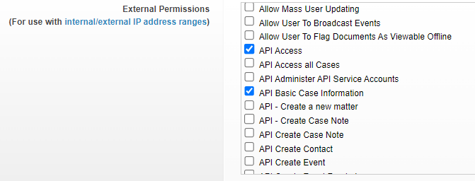
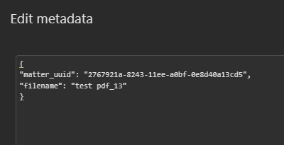
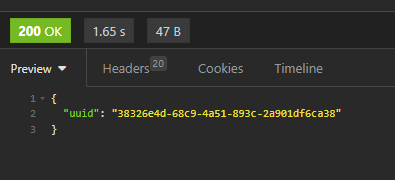
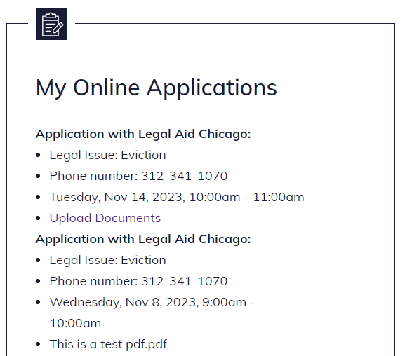
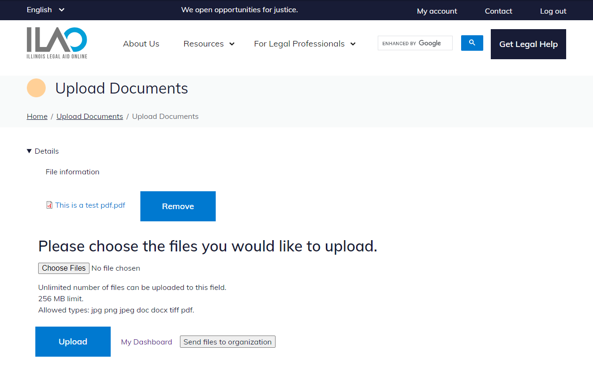
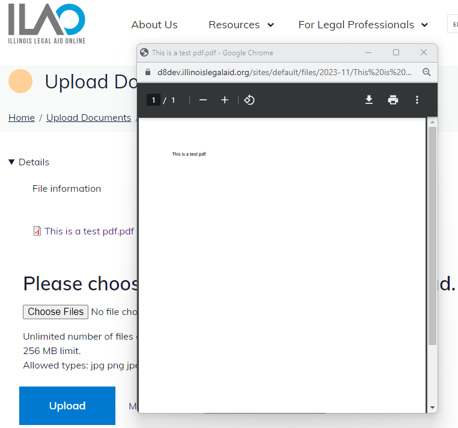

=======================
Document (File) Upload
=======================
Overview
=========
LegalServer allows documents to be uploaded via an API call either through the online intake site or directly to the partner's case management site. See [LegalServer documentation](https://apidocs.legalserver.org/docs/ls-apis/6a2979a35420d-upload-a-new-document-to-the-system). We are currently allowing online applicants to upload documents directly. To upload through the online intake site, an applicant must have their document available when completing the intake. Unfortunately, uploading directly to the partner's site also has some limitations. To upload a document directly to the OTIS partner's LegalService case file, the case file must be started in the partner's LegalServer (i.e., intake has to have begun). 

Partner setup
=====================
To initiate a file upload from ILAO's site, Online Triage and Intake System (OTIS) partners must create an ILAO user within their LegalServer and give that user proper API permission. Once that user is created, we need the following information from the OTIS partners:

* **LegalServer site URL:** This information has already been provided to ILAO through the other connections, but to upload files, we need to use the base URL plus /api/v1/documents.
* **Authorization:** We can accept either basic authentication or a bearer token:

  * *Basic authentication* refers to using a username and password. ILAO should be informed if the organization's security settings require the password to be updated after a certain period of time and the partner will need to facilitate updating the password and informing ILAO.
  * *Bearer token* refers to a unique string of 48 characters that can be used to log in.

* **Required permissions:** To give ILAO access, the OTIS partner will need to create an ILAO-API user within their LegalServer and grant that user "API Basic Case Information" permission

API requirements
=================
To send a file via an API call to LegalServer, the API requires the correct URL, authentication, a case identifier (matter id or globally unique id), a filename, and the file.

* **Correct URL:** [legalserver base URL]/api/v1/documents
* **Authentication:** either basic authentication or a bearer token.
* **Case identifier:** This can be either the Matter/Case ID or the Globally Unique ID. Since we are electronically transferring the case file from Illinois state-wide instance of LegalServer to the OTIS partner's instance, the Matter/Case ID changes with the LegalServer instance, we are using the Globally Unique ID. The Globally Unique ID is provided to ILAO from LegalServer during the initial transfer of information to LegalServer and is stored in ILAO's internal database.

* **Filename:** The filename is captured when the applicant uploads the file.
* **File:** Applicants can upload jpg, jpeg, png, tiff, doc, docx, and pdf file types.

When the file is properly sent to the OTIS partner's LegalServer, ILAO receives a confirmation with a unique identifier for the uploaded file.

Applicant (user) process
=========================
To upload a file, an applicant must first complete an online application. Currently, we have limited file uploads to applicants who have created an account on ILAO, but there are plans to expand the file upload capacities to applicants who choose not to create an ILAO account. Having an ILAO account allows us to save a person's application information so they can return to it later. We plan to look up an applicant's file in a process similar to printing your boarding pass at the airport (last name and a unique 6 digit code).

1. If a person either creates an ILAO account or logs in at the completion of their online application, they will be able to see their completed applications on their My account page (/users/[first]-[last]).

2. From their list of Online Applications, an applicant will have a link to upload files only if the OTIS partner allows file uploads. When they select the Upload Documents link, they are taken to a new page where they have the ability to upload one or more files and send those files to the OTIS partner.

3. They also have the ability to preview any of the files they have upload prior to sending the files.

4. Finally, when they send the files to the OTIS partner, they are redirected back to their My account page and will see a confirmation message to let them know the file(s) were properly uploaded.
