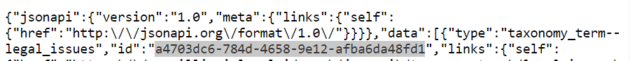

.. _guided_nav_functions:

================================
Guided Navigation SMS functions
================================

These functions allow us to interact with LegalServer's Guided Navigation API over Twilio SMS.  They can be found in the Guided Nav service on Twilio

Validate keyword
=================

**Function name:**

* mr-validate-legal-issue-gn (current)
* validate-legal-issue-gn (deprecated)

**Parameters:**

* event.legal_issue; this is a text value from either the initial trigger message body or in response to start-otis. This allows users to enter a word like "evict" or "snap" to bypass the OTIS get legal issue subflow to identify the user's legal issue.
* event.language_number; this is a numerical value that identifies the language of the user to match the legal issue provided in the correct language.

**Returns:** An object containing:

* code - corresponds to the list of legal issues within the function. If the legal_issue parameter does not match a value in the function, the code will return as -1.

**Widget(s):** validate_keyword

**Flows:** Superbot main flows: SuperbotV2 & SuperbotV3

Validate legal issue
=====================

**Function name:**

* mr-validate-legal-issue-flow (current)
* validate-legal-issue-flow (deprecated)

**Parameters:**

* event.legal_issue; this is a text value from widget: start-otis. This allows users to respond to a question about their legal issue if they did not get matched to a legal issue based on their trigger word (i.e. they didn't text "evict" to 85622).
* event.language_number; this is a numerical value that identifies the language of the user to match the legal issue provided in the correct language.

**Returns:** An object containing:

* code - corresponds to the list of legal issues within the function.

**Widget(s):** validate-legal-issue

**Flows:** OTIS get legal issue

Get process list
==================

**Function name:**

* mr-get-process-list (current);
* get-process-list (depricated)

**Parameters:**  event.issue; this is the numeric value from whatever Twilio flow that is calling the process list. This will return the process id and metadata for the specific legal issue's Guided Navigation.

**Returns:** An object containing:

* processid - the unique identifier for a Guided Navigation process; if no matching process is found, will return 0.
* lsc_code - the LSC problem code associated with the process
* search_term - the default search term to store in ILAO's data. The search_term can be found by going to https://www.illinoislegalaid.org/jsonapi/taxonomy_term/legal_issues?filter[foo][condition][operator]==&filter[foo][condition][path]=drupal_internal__tid&filter[foo][condition][value]=514486, but changing "514486" to the legal_issue value used on the Case Acceptance webform. The search_term value is the "id".

.. note:: Processes are as follows so far 1 - unemployment benefits, 2 - Food stamps, 3 - TANF benefits, 4 - Renting or Renters, 5 - Expungement, 6 - DV, 7 - Bankruptcy (not live yet), 8 - Asylum/Immigration (not live yet).

**Widget(s):**

* get_gn_process (Superbot);
* get-gn-process-id (Get legal issue); and
* rerun_process (Guided Navigation)

**Flow(s):**
* Superbot main flows:

  * SuperbotV2_LIVE_9.11.23
  * SuperbotV3

* OTIS get legal issue
* OTIS Guided Navigation

Start a new session for given process
=========================================

**Function name:**  start-process

**Parameters:**  event.processid; this is the process id returned from the get-process-list function.

**Returns:** An object containing:

* sessionid; the session ID returned by Legal Server. This is used throughout a user's Guided Navigation session.

**Widget:** start-gn-process

**Flow:** OTIS Guided Navigation

**Requires:** username and password credentials to access the Legal Server API. These are currently stored in the function for the demo site only.

Get the guided navigation form
================================

**Function names:**

* get-form-test-multiple (current)
* get-form-test (deprecated)

.. warning:: THIS IS CURRENTLY BEING USED IN get-final-gn-profile

* get-form-multiple_v2 (in production) - adding support for 'combined_outcome' to show the user their "Best match" when there are multiple organization who will help with a legal problem, but 1 or more of the organizations will help with multiple aspects of the legal problem

.. note:: If an applicant is facing a house foreclosure and a car repossession, all Orgs will take the case, but Org C is the "Best match"

  * Org A will take a bankruptcy case to stop a house foreclosure
  * Org B will take a bankruptcy case to stop a car repossession
  * Org C will take a bankruptcy case to stop a house foreclosure & a car repossession

**Parameters:**

* event.processid - the unique identifier for a Guided Navigation process
* event.sessionid - the unique identifier for the Guided Navigation session; this was returned by LegalServer when the session started
* event.language

**Returns:** an object that contains the next step in the guided navigation process. This function provides additional text to inform the applicant how to respond. Ex:

.. code-block:: javascript

      if (res.data.form.elements[j].is_multiple == true) {
        response.display.suffix = 'Reply with the numbers that apply to you. For example, reply 1,2,3';
        response.display.multiple = "Multiple";
       }

This code automatically adds the additional text about how to respond if the guided navigation element allows multiple responses (checkboxes).

**Widget:** get-current-gn-form

**Flows:**

* OTIS Guided Navigation
* OTIS Guided Navigation_v2

**Requires:** a sessionid and processid

**Supports:**

* Instructions with the next element when the instruction is not the first element in the guided navigation process
* radio button options (user must choose one answer)
* checkbox options (user can choose multiple options, ex: 1,3,4)

Save form data submitted for a session
========================================

**Function name:**  update-process

**Parameters:**

* event.processid; this is the process id returned from the get-process-list function.
* event.sessionid; this is the unique session id returned from the start-process function. This is consistent across an entire user's session
* event.form_id; this is the unique form id returned from the get-current-form function. This is unique per instance of a form.
* event.element; this is the unique identifier in Legal Server for the form field.
* data_value; this is the data from the application.  This may be:

  * a date formatted as 2021-01-01
  * a numeric value representing the value from the form options

**Returns:** An object containing:

* is_complete; a Boolean (true or false) indicating whether the Guided Navigation session is complete.

**Widget:** update-gn-data

**Flow:** OTIS Guided Navigation

**Requires:** username and password credentials to access the Legal Server API. These are currently stored in the function for the demo site only.

.. note:: Legal Server returns a larger object set but all we care about here is the is_complete value. We use the get-current-form function to get a clean copy of the current form.

Getting the current form
==========================

This function gets the current form for a specific session and then parses it into something usable in the Twilio application.

**Function name:**  get-current-form

**Parameters:**

* event.processid; this is the process id returned from the get-process-list function.
* event.sessionid; this is the unique session id returned from the start-process function. This is consistent across an entire user's session

**Returns:** An object which varies based on the type of form returned.

* In all instances, the sessionid
* In all instances, the current user session's profile. This contains the field names and values collected.

.. code-block:: json

        "profile": {
        "id": "0263357e-0431-11ec-9b2f-0e8d40a13cd5",
        "ilao_unemploy_search_149": 3
         },

* In all instances, the curent form_id
* In all instances, the is_complete value for the current form
* In all instances, a display object to control how the form is displayed

When the form returned includes a profile field with the _outcome, which indicates that we've reached the exit variable, the response object includes:

* outcome_variable, which is the field name of the outcome field
* outcome_value, which is the value of the outcome field

When the form incudes a form element, the response object is updated:

* display.id, which is the element ID of the form element
* display.label, which is the label used in the form element
* display.text, which by default is an empty string.

When the form element type is "instructions":

* display.text is added to return a cleaned version of the instructions text

When the form element type is "Boolean" or "Select"

* display_text (for Boolean) returns the Yes or No string
* an options element is added to the display object that includes, for each defined option:

  * label of the option
  * value of the option
  * counter, which is a 1-based index for the display (because arrays are 0-indexed, we use the counter to better display results)

* a suffix of "Reply with the number."

.. todo:: the suffix should be removed and added to the flow to be language-neutral.

When the form element type is "Date", returns:

  * an empty display.options array
  * a display.suffix of "Reply with a date formatted as mm/dd/yyyy."
  * display.text of the form label

**Requires:** username and password credentials to access the Legal Server API. These are currently stored in the function for the demo site only.

Getting Guided Navigation matches
===================================

This function returns any intake settings ids that are a match based on a match be

**Function names:**

* get-gn-match-test (current)
* get-gn-match (deprecated)

**Parameters:**

* event.token
* event.user_issue = the number of the final case acceptance outcome value
* event.outcome_field = the outcome field name
* event.rest_export = this value tells the system which case acceptance rest export webform to look in for matches

**Returns:** An array of intake settings ids that match on the outcome field and value. This array does not filter on location or any other criteria. It simply returns webform case acceptance matches against Guided Navigation.

.. note:: This function currently relies on the gn-outcome-list asset in Twilio for data. This asset should be updated whenever webforms change.

.. todo:: Replace gn-outcome-list with live data from our API.

**Widget:** get-gn-matches

**Flow:** OTIS matches

Process qualifiers
====================

**Function name:** process-qualifiers

**Purpose:** determine if the applicant is qualified for their chosen organization or if they need to apply for a different organization

**Parameters:** event.intakeids.split

**Returns:** an object that contains either:

* qualified ("Great")
* disqualified ("Unfortunately, you did not match to {{org}}. You can visit Get Legal Help for more help.")
* null - will redirect the applicant to their other matched organizations.

**Widget:** reselect-qualifiers

**Flows:**

* Superbot main flows:

  * SuperbotV2_LIVE_9.11.23
  * SuperbotV3

**Status:** in development
