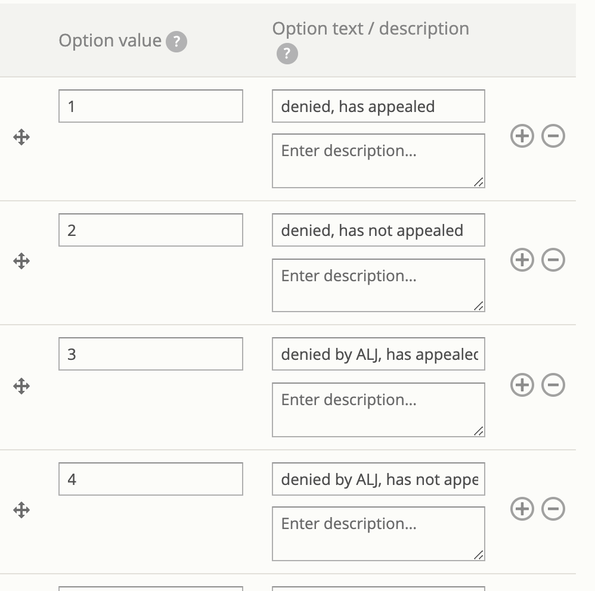

.. _otis-case-webform:

=================================
Creating case acceptance webform
=================================

Create a webform
==================

Go to `Manage webforms <https://www.illinoislegalaid.org/admin/structure/webform>`_ and add a webform.

The webform should:

* Have a title of Case acceptance - [legal issue] where legal issue is the name of the specific legal problem covered by the form.
* Be tagged to the Guided Navigation category.

Required fields
-----------------
* service. This field must:

  * be of type entity_radios
  * have an entity reference settings of:

    * type of item to reference = Content
    * reference method = Views: Filter by an entity reference view
    * view used to select the entities: entity_reference_content - Location Services (accepted through IllinoisLegalAid)

* legal_issue

  * should be of type hidden
  * should have a default value of the taxonomy term id for the parent legal issue for the form. For example, if the form covers all Unemployment benefits, it should have the legal issues term ID for the Health & Benefits -> Unemployment benefits term. When a user then accesses any term beneath that term, this will be the referenced case acceptance form.

* outcome fields. These should come from the Guided Navigation and

  * are checkboxes fields
  * have a key that matches the Guided Navigation field name (for example, ilao_snap_apply_outcome_191, ilao_snap_apply_outcome_193)
  * option value for each checkbox should match the option value for the field in Legal Server.

Optional fields
-----------------
Additional fields can be used to improve usability but will not be used in the Guided Navigation/SMS system.

Populate the webform
======================

Once created, the webform needs to be populated with case acceptance information for each service.

This means:

* Selecting the service to apply it to. The service should have an intake settings that matches on the hidden legal issue.
* Check the boxes that align with the program's case acceptance priorities.

.. todo:: At this time, we aren't filtering on population in SMS. Therefore, any population settings in the service(s) will be ignored.

What submissions get used
==========================
As changes are made, the system will ignore:

* any webform submission in a draft state
* any webform submission for a particular service that is older than another webform submission for the same service.  For example, if on Monday, I create a submission for Legal Aid Chicago's client screening unit and create another one on Friday, only Friday's will be used.

.. note:: Only services with matching intake settings on the legal issue will be returned. For example, if on the unemployment benefits case acceptance form, Legal Aid Chicago's client screening unit does not have any intake settings tied to unemployment benefits, they will not return as a result even if the case acceptance form indicates that they take cases for unemployment.

