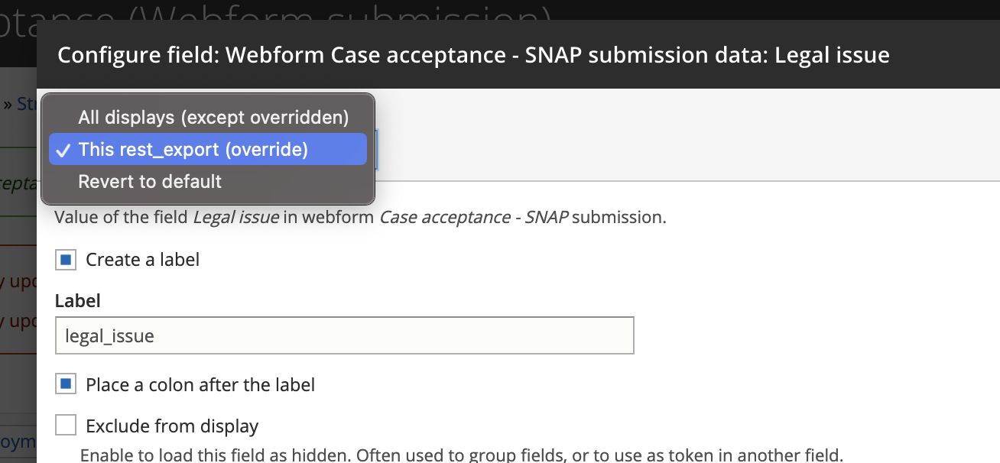
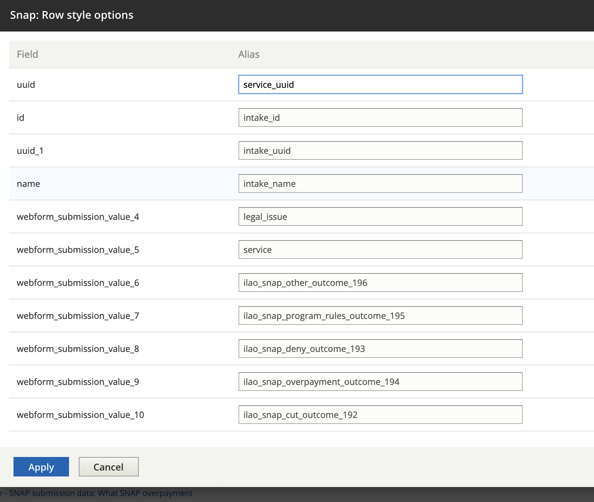
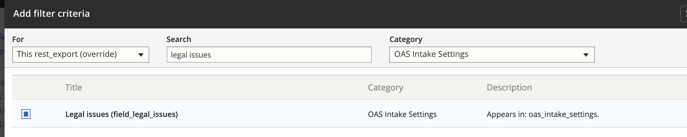
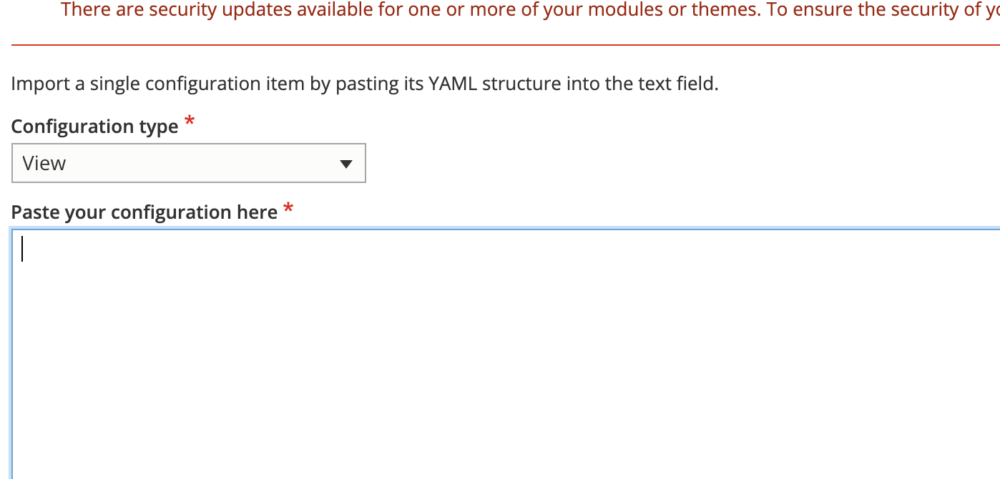

.. _otis-case-view:

===============================================
Create a rest export for the case acceptance
===============================================

Once the case acceptance webform is created, the next step is to update the case acceptance view to create a REST-based export for the webform.

Creating the REST Export
==========================
To make the webform submission data available in other systems, we need a REST export for each individual webform.  This is accomplished by creating a REST export in the `case acceptance <https://www.illinoislegalaid.org/admin/structure/views/view/case_acceptance>`_ view.

The REST export connects webform submission data with the service associated with the webform and with the intake settings entity associated with the service.

.. warning:: You will want to back up the view just in case you mess it up so badly that you need to restore it. See the backup and restore instructions at the bottom of this page.

.. warning:: New rest-exports should be created in DEV Environment and then exported/imported to production.

Path settings
--------------
Each REST export must have a path. That path should be set to /rest/[category]-cases

Format
---------
.. warning::

   It is absolutely CRITICAL that when creating the rest export, the "For" dropdown is always ALWAYS set to This rest_export override to avoid messing up other exports.

Each rest export must:

* have a format of serializer set to show fields. Once the format is set to serializer, open settings and select json from the Accepted request formats.
* in the Show field settings, each field in the results should have an alias that matches the actual key name

Fields
-----------
The fields should include data associated with the specific webform:

* the legal issue field - labelled (**legal_issue**). This should be set to **value**.
* the service from the webform - labelled (**service**). This should be set to **Entity ID**.
* each **outcome field** in the webform. These should be set to show all multiple values with a format of **raw value** - labelled ([raw field name for the outcome]).

In addition, we need to relate the service and the service's matching intake settings. To do this, first, we need to create the relationships.

* For the service, it is the Referenced Content in the category of the [name of webform]  submission data with a description of Value of the field Service in webform
* For the intake setting, it is the title of "OAS Intake settings using field_service_single" of category content with a description of "Relate each OAS Intake Settings with a field_service_single set to the content item. It should then show a relationship dropdown set to "Content"

Once the relationships are set, the fields should be updated to include:

* the uuid for the service.  This is found under title = UUID, category = Content. This must have a relationship of Content - labelled (service_uuid)
* the id for the intake settings. This is found under title = id, category = OAS intake settings.  This should have a relationship of field_service_single in the drop down - labelled (intake_id)
* the uuid for the intake settings.  This is found under title = UUID, category = OAS intake settings.  This should have a relationship of field_service_single in the drop down - labelled (intake_uuid)
* the name of the intake settings.  This is found under title = name, category = OAS intake settings.  This should have a relationship of field_service_single in the drop down - labelled (intake_name)
* the id for the service. This is found under title = id, category = content. This should have a relationship of content - labelled (service_id).
   * this may not be necessary. the service id is being captured above under service 

Filter Criteria
-------------------
The first filter criteria should limit the intake settings to the legal issue that matches the webform.  For example, the SNAP webform is limited to intake settings with a legal issue of "Food stamps" (which automatically includes child terms). The Views filter requires that you match on the term NAME rather than the ID.

This should have a relationship of field_service_single. The Operator: is one of and the term should be the legal issue term (i.e. "Food stamps","Eviction","Renting a mobile home",etc.

The second filter criteria should limit the intake settings to open intake settings. Search "Is Intake Setting open or not?" in the category OAS Intake Settings. Relationship should be field_service_single. Operator Is equal to. Is Intake Setting open or not? set to True.

The third filter criteria should limit the Case Acceptance Webforms to the one with the correct legal issue. Search "Legal issue" in the category Webform Case Acceptance - [legal issue] submission data. Operator Is equal to. The Legal issue should be the same legal issue id in the Case Acceptane Webform for the issue. (i.e. Expungement = 517681 (criminal records)).

The fourth and fifth filter criteria should limit the results to only display the English versions of the Service and Intake settings. Search "Language" in the category of All. Select both Translation language in the category of Content with a description of The language of the content or translation and Translation language in the category of OAS Intake Settings with no description. For Content: Translation language: the Relationship should be set to Content; Operator Is one of; and Language is Site's default language (English). For OAS Intake Settings: Translation language: the Relationship should be set to field_service_single; Operator Is one of; and Language is Site's default language (English).

The final filter criteria should limit the Case Acceptance Webforms to ones that have been completed (not drafts). Search "Is draft" in the category Webform submission. Operator Is equal to. Is draft set to False.

Sort Criteria
----------------

To ensure we are only counting the most recent webform for a service, the sort criteria should be set to use Webform submission : Submission id ordered descending.  This can be found under category webform submission, title submission id.

.. note:: Webform submission is a category independent of each of the specific webforms' submission categories.

Pager
---------
Pager should be set to Display all items

Saving
---------
Before saving, you must adjust the timeout in Acquia: Select Dev Environment - Configuration/Advanced - change Max execution time to 300. Once rest-export is saved, change the timeout back to 60 seconds.

Sample REST Export
==========================

Admin interface for view
--------------------------

Sample Data Export
--------------------
.. note:: Data exports are only accessible with an access token from our API. If you are logged into the website, it should be visible via a web browser.

.. code-block:: JSON

   [
    {
        "legal_issue": "515831",
        "service": "29531",
        "unemploy_apply_outcome_182": "1, 2, 3, 4, 5, 6, 7, 8, 9, 10, 11, 12",
        "ilao_unemploy_program_rules_outcome_186": "1, 2, 3, 4, 5, 6, 7, 8",
        "ilao_unemploy_deny_outcome_183": "1, 2, 3, 4, 5, 6, 7, 8, 9, 10, 11, 12, 13, 14, 15, 16",
        "ilao_unemploy_overpayment_outcome_184": "1, 2, 3, 4, 5, 6, 7, 8",
        "ilao_unemploy_cut_outcome_187": "1, 2, 3, 4, 5, 6",
        "service_id": "29531",
        "service_uuid": "7764b08b-9d7a-4729-860b-03ae8736b4ee",
        "intake_id": "1496",
        "intake_uuid": "8146226a-a2dc-4ae7-ba57-4b6a5940f403"
    },
    {
        "legal_issue": "515831",
        "service": "28806",
        "unemploy_apply_outcome_182": "1, 2, 3, 4, 5, 6, 7, 8, 9, 10, 11, 12",
        "ilao_unemploy_program_rules_outcome_186": "1, 2, 3, 4, 5, 6, 7, 8",
        "ilao_unemploy_deny_outcome_183": "1, 2, 3, 4, 5, 6, 7, 8, 9, 10, 11, 12, 13, 14, 15, 16",
        "ilao_unemploy_overpayment_outcome_184": "1, 2, 3, 4, 5, 6, 7, 8",
        "ilao_unemploy_cut_outcome_187": "1, 2, 3, 4, 5, 6",
        "service_id": "28806",
        "service_uuid": "e268cf91-5994-4cca-a751-0cabd76bb3d8",
        "intake_id": "1451",
        "intake_uuid": "dad7f107-94c6-42b9-9033-30bbe37a6fb6"
    },
    {
        "legal_issue": "515831",
        "service": "29561",
        "unemploy_apply_outcome_182": "1, 2, 3, 4, 5, 6, 7, 8, 9, 10, 11, 12",
        "ilao_unemploy_program_rules_outcome_186": "1, 2, 3, 4, 5, 6, 7, 8",
        "ilao_unemploy_deny_outcome_183": "1, 2, 3, 4, 5, 6, 7, 8, 9, 10, 11, 12, 13, 14, 15, 16",
        "ilao_unemploy_overpayment_outcome_184": "1, 2, 3, 4, 5, 6, 7, 8",
        "ilao_unemploy_cut_outcome_187": "1, 2, 3, 4, 5, 6",
        "service_id": "29561",
        "service_uuid": "cbb2b332-42ff-49c1-82e0-106be43e27e2",
        "intake_id": "1486",
        "intake_uuid": "cdfa5e87-fcf7-4bb9-a483-e8dbe58897af"
    },
    {
        "legal_issue": "515831",
        "service": "29556",
        "unemploy_apply_outcome_182": "1, 2, 3, 4, 5, 6, 7, 8, 9, 10, 11, 12",
        "ilao_unemploy_program_rules_outcome_186": "1, 2, 3, 4, 5, 6, 7, 8",
        "ilao_unemploy_deny_outcome_183": "1, 2, 3, 4, 5, 6, 7, 8, 9, 10, 11, 12, 13, 14, 15, 16",
        "ilao_unemploy_overpayment_outcome_184": "1, 2, 3, 4, 5, 6, 7, 8",
        "ilao_unemploy_cut_outcome_187": "1, 2, 3, 4, 5, 6",
        "service_id": "29556",
        "service_uuid": "69c4390d-7640-4908-b857-62fa395d6ddb",
        "intake_id": "1491",
        "intake_uuid": "2a5ec609-e94a-4aaa-b41c-c2cb483d000c"
    },
    {
        "legal_issue": "515831",
        "service": "29586",
        "unemploy_apply_outcome_182": "1, 2, 3, 4, 5, 6, 7, 8, 9, 10, 11, 12",
        "ilao_unemploy_program_rules_outcome_186": "1, 2, 3, 4, 5, 6, 7, 8",
        "ilao_unemploy_deny_outcome_183": "1, 2, 3, 4, 5, 6, 7, 8, 9, 10, 11, 12, 13, 14, 15, 16",
        "ilao_unemploy_overpayment_outcome_184": "1, 2, 3, 4, 5, 6, 7, 8",
        "ilao_unemploy_cut_outcome_187": "1, 2, 3, 4, 5, 6",
        "service_id": "29586",
        "service_uuid": "08239044-9600-4b66-a8d6-d93202c3861a",
        "intake_id": "1481",
        "intake_uuid": "60d1a71c-79a6-4cb8-be7b-a27ebca9ea6e"
    }]

Next Steps
============

Once the view is created and accessible, it can be added to Twilio as the final step in the process.

.. note:: Changes to the case acceptance webform will automatically be included in the REST-export each time the view updates.

Backing up and restoring a view
=================================

To backup a view
------------------

* Go to the `single export page <https://www.illinoislegalaid.org/admin/config/development/configuration/single/export>`_
* Under configuration type, select View
* Under configuration name, select case acceptance
* Copy the configuration into a text editor

.. image:: ../assets/config-single-export.png

To restore a view
-------------------

* Go to the `single import page <https://www.illinoislegalaid.org/admin/config/development/configuration/single/import>`_
* Under configuration type, select View
* Copy the configuration from the text editor back into the website
* Press import

