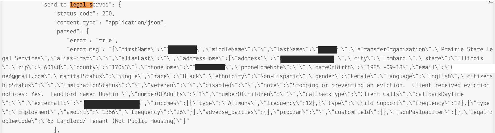
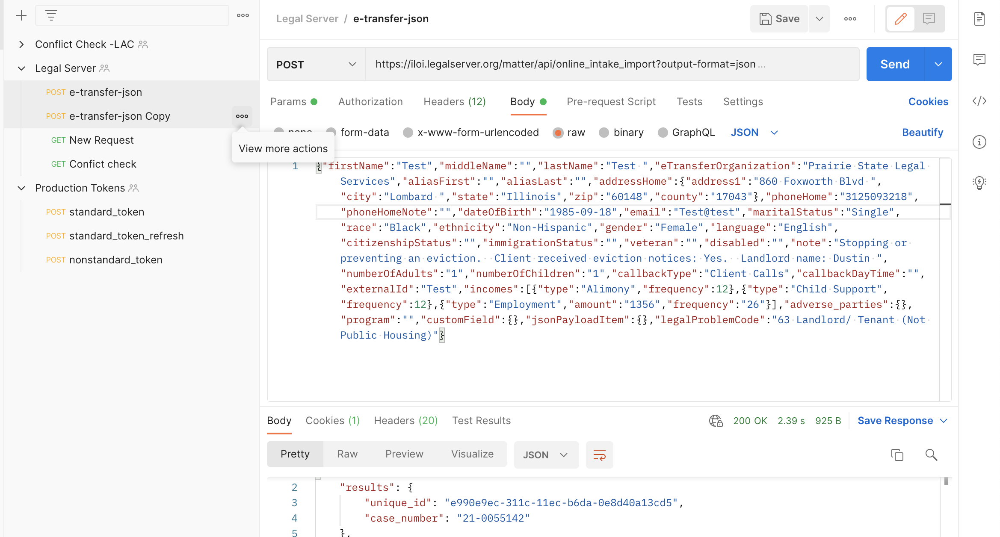

================================
SMS etransfer failures
================================

When an etransfer fails over SMS, the system will send a failure message to an ILAO contact with the flow ID of the failed message from the phone number associated with the flow.

When a failure occurs, the ILAO contact should:

* In Twilio, access the flow id in the log for the specific flow
* Go into the flow data
* Scroll down to the send_to_legal_server section

* Copy and paste the error message piece into a text editor (the section within the outermost quotes.
* Do a find and replace on all \n to replace with nothing
* Do a find and replace on all \ to replace with nothing
* Fix the problem in the code (examples may include an extra space in a date field, too long of a phone number)
* Open postman and in the team workspace, use the e-transfer JSON request in the Legal Server folder
* Drop the pasted text into the body
* Send the request
* You should get either a confirmation with a unique_id (as shown below) OR an error message that should allow you to further debug.

Once this is done, the etransfer should be completed for the user. The user will not receive an error in SMS that their application failed.
