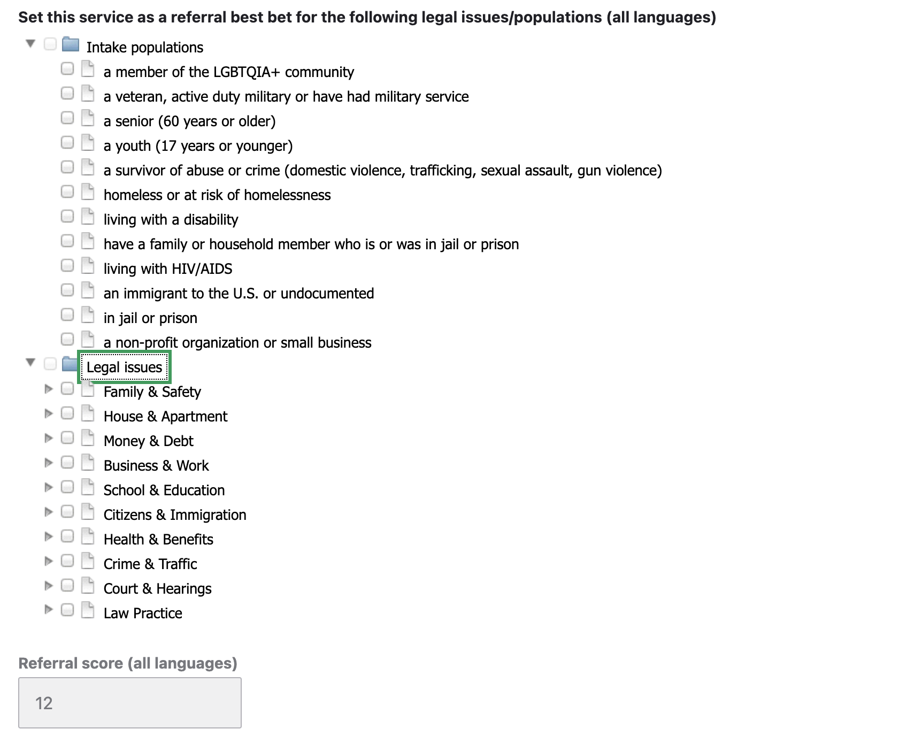
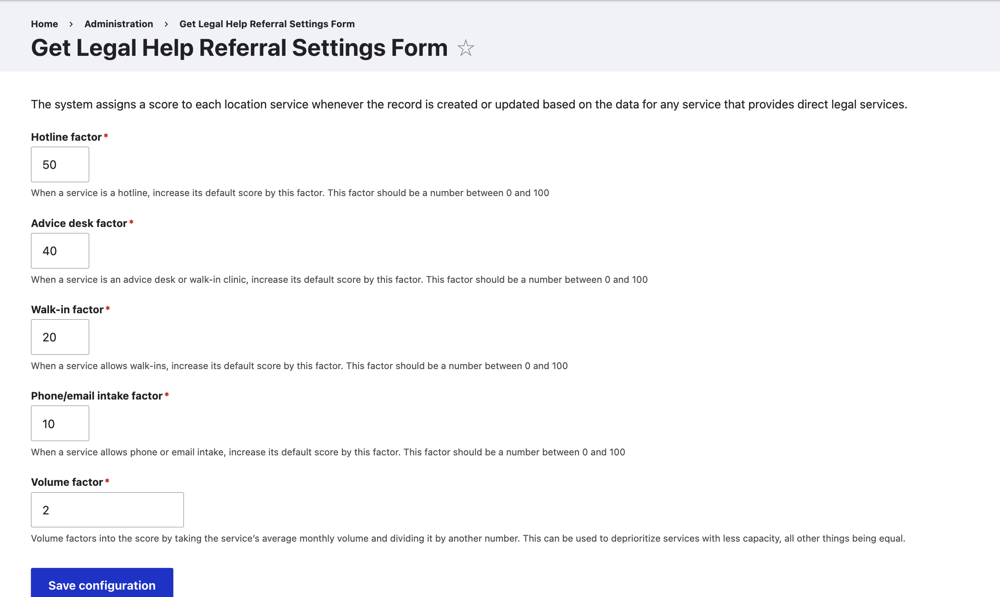

==================================
Referral algorithm  management
==================================

There are three factors that can be managed to prioritize certain organizations over others.

Prioritize for a specific population or legal issue
======================================================

Prioritizing for a specific population or legal issue is helpful when:

* The service should always be the top result for a particular legal issue, especially when there are many options for the legal issue
* The service should always be at the top for a particular population, particularly when the service is not restricted to specific populations or there are many competing services.

When the user matches on population and/or legal issue, these services will be prioritized first.

Referral Score
===================

The referral score is coded on the back end when the location service is saved. The score is based on settings contained in the `<a href="https://www.illinoislegalaid.org/admin/organizations/referral-settings">Referral Settings Form`_

For a service, the score is calculated by:

* All referral scores start at 0
* If the service is a hotline, adds the hotline score factor to the score
* If the service is an advice desk, adds the hotline score factor to the score
* If the service allows walk-ins, adds the walk-in score factor to the score
* If the service allows telephone or e-mail intake, adds the phone/email factor to the score.
* Calculates a volume score to add to the referral

  * If the volume score factor is 0, ignores volume.
  * If the volume score factor is not 0, adds the monthly volume / volume factor. For example:

    * If the volume is 1000 and factor is 1, will add 1000 to the score
    * If the volume is 1000 and factor is 5, will add 200 to the score
    * If the volume is 1000 and factor is 0, will add 0 to the score.

