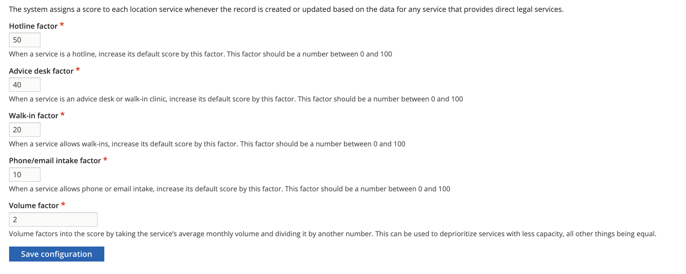

================================
Organization referral algorithm
================================

The 2017 - 2023 algorithm is being refined going into 2024.

Current Algorithm
====================
The current algorithm uses a highly complex set of SQL queries to pull referrals and depend on whether the individual's:

* response to the income yes/no question
* whether the individual selected any special populations

Not over-income individuals
-------------------------------
An individual who is not over-income will receive 3 free or low cost referrals:

* 1 organization that delivers services in-person
* 1 organization that delivers services online
* 1 organization that delivers services by phone

Where an organization provides services in multiple ways, they will only be returned for on one of the 3 options and the next available option will appear.

Over-income individuals
--------------------------

An individual who is not over-income will receive 3 free or low cost referrals:

* 1 organization that delivers services in-person
* 1 organization that delivers services by phone

Where an organization provides services in multiple ways, they will only be returned for on one of the 3 options and the next available option will appear.

.. note:: At the time this algorithm was created, there were no online only options that were open to individuals with higher incomes.

How referrals within each category are prioritized
----------------------------------------------------

To be a referral, the service must:

* Match on population or not be tagged to any population
* Match on location (city, state, zip, county) against the individual's provided zip code
* Match on income limitations if the individual is over-income

The referrals are then ordered by

* Score; based on:
  * Has a volume defined and has regular weekly hours (volume/3000 + 1.25)
  * Has a volume defined but does not have regular weekly hours (volume/3000 + .75)
  * Has no volume defined

    * But has regular weekly hours, volume = .75
    * And does not have regular weekly hours, volume =. 25

* If service delivery is in person and has irregular hours, has a date in the next 7 days

2024 Implementation
====================
The updated algorithm does not pay attention to the method of how services are delivered as that is not particularly helpful to individuals. It is also designed to be less dependent on long SQL queries.

Scoring Metrics
------------------

Referral Score
^^^^^^^^^^^^^^^^^^

The system will automatically generate a score for location services content based on data in our Get Legal Help referral settings form. This score replaces the previous scoring done within the query.

Referral Best Bets
^^^^^^^^^^^^^^^^^^^^

Staff users can set a location service to be a best bet for a particular legal issue or intake population, or both.

Results Algorithm
===================

The referrals page will return up to 4 sets of results:

* Best Bets - the first results will be any location service that:

  * Matches on location and legal issue
  * Matches on population, or is not limited to any population
  * Is open
  * Provides direct representation
  * Is a Best Bet on the legal issue OR Is a best bet on a population the user is a member of
  * Is then ordered by referral score descending if there are multiple matching Best Bets

* Top Results - up to 5 results of any location service that:

  * Matches on location and legal issue
  * Matches on population, or is not limited to any population
  * Is open
  * Provides direct representation
  * Is not a Best Bet on the legal issue OR Is a best bet on a population the user is a member of
  * Is then ordered by referral score descending with a limit of 5 results

* Bar referrals
* The LSHC serving the user's county.

