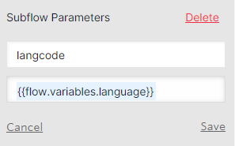
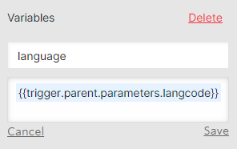

====================
Flows and Subflows
====================

Primary flow
=============
Users applying over SMS enter a primary flow that controls a series of subflows. The primary flow is aptly named "Superbot" with the version number and the date it went live. The Superbot flow is greatly simplified with the use of subflows. The flow is visually structured in 3 columns starting at the top right and moving first down and then to the top of the column to the left of the current column. 

Each time Superbot starts a subflow, variables that are needed for that subflow are passed to the subflow as parameters from the run subflow function. The language variable is passed into every subflow to allow the system to respond to the user in the correct language.

Adding parameters to a subflow

Setting variables for the subflow

Subflows
=========

* **OTIS get legal issue:** If an applicant does not text a term that we have set for a particular path (i.e., eviction, divorce, bankruptcy, SNAP, etc.), the OTIS get legal issue path asks the applicant to identify their legal issue by starting at a top of the tree triage question. Ideally, the applicant was instructed to text a certain word to the short code ("text 'eviction' to 85622") which will allow them to bypass this subflow.

* **OTIS get location:** Gather's the user's first name & location by zip code.

.. note:: If an applicant has identified their legal issue as an eviction legal issue, they will be shown information on housing counselors during this subflow if they are interested.

* **OTIS household:** Before an applicant begins the triage and intake, an initial screening is done by asking about the applicant's household size and if their income is more than 300% of the Federal Poverty Level. The 300% Federal Poverty Level is provided to the applicant based on a rough calculation of their household size. 

* **OTIS Guided Navigation:** Runs the guided navigation dialogue or dialogues based on the originally identified process_id. The process_id was assigned either in the Superbot flow by the self-identified legal issue or the OTIS get legal issue subflow. Once an applicant starts a guided navigation dialogue, the guided navigation logic will automatically move them to different dialogues to gather ancillary information or to switch their legal issue, if necessary (example: An applicant could start in the filing for bankruptcy dialogue and end in the foreclosure dialogue if they identified that they want to file for bankruptcy protection because of a pending foreclosure issue). At the end of guided navigation dialogue, the applicant will be assigned a _outcome value. This value is used to match them to an organization in their area to help.

* **OTIS matches:** Using the _outcome value assigned during OTIS Guided Navigation and the zip code provided in OTIS get location, the get-[gn/otis]-matches functions determine if the applicant's legal issue and geographic area are matched to one or more organizations to help. If matched, the applicant will be given the list of organizations and they will have the ability to choose where they want to apply.

* **OTIS Guided Navigation:** If the matched/chosen organization has qualifiers to determine if the applicant is a good match, the OTIS Guided Navigation flow is run again to run the particular qualifier guided navigation path. Qualifiers allow an organization to ask specific qualifying questions like, "Do you or someone in your family attend Evanston Schools? (District 65 or 202)." If an applicant is not qualified for the matched organization and they were matched to other organizations, they have the opportunity to select a different organization to apply for help.

* **OTIS Intake:** Similar to applying for legal help on www.illinoislegalaid.org/get-legal-help, an applicant will be asked intake information that saves the partnering organization time completing the intake. The applicant is asked:

    * last name (and maiden or nicknames)
    * date of birth
    * race
    * ethnicity
    * gender
    * veteran status
    * disability status
    * income from:

        * employment or self-employment
        * Social Security (SS), Social Security Disability (SSD), or Supplemental Security Income (SSI)
        * Unemployment, SNAP, or TANF
        * Child support or alimony
        * Private disabilty benefits or Worker's compensation
        * Retirement benefits or Veteran's benefits
        * Investment income
        * Income from any other source

Before the applicant returns to the next step, they are provided a calculation of their total income to verify.

* **OTIS contact information:** Contact information such as a good phone number, mailing address, and email address are gathered during OTIS contact information. Although the applicant is completing their application on a mobile device, we still verify that the number they are messaging from is a good number to contact them. If not, they are given an opportunity to provide a different number. The applicant's address is gathered in parts by asking the street address, any apartment/unit number, city, state, and zip code. The applicant has an opportunity to verify the information.

* **OTIS appointment scheduler:** If the matched/chosen organization's intake settings use the "we call you" callback type, the applicant will need to schedule an appointment for a callback. The applicant will be shown the first available day/times and if those do not work, they will be shown later available times. The appointment times are based on the organizations set intake appointment times (available hours/day and days/week). These appointment times also take into consideration scheduled closed days for the organization and holidays.
