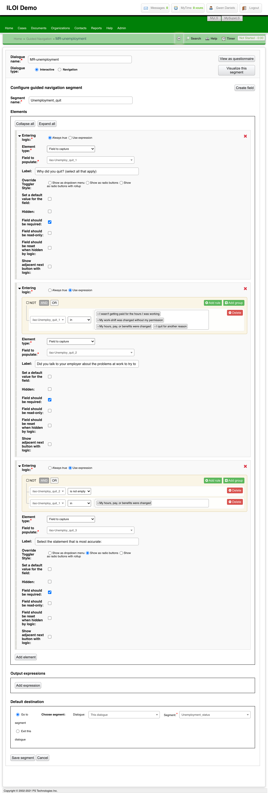
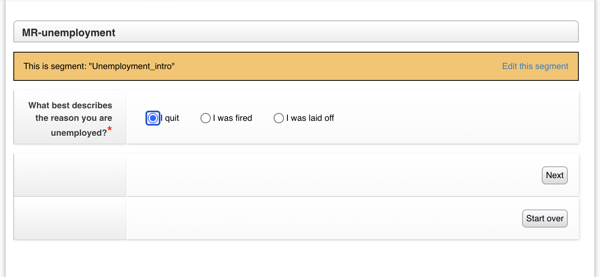
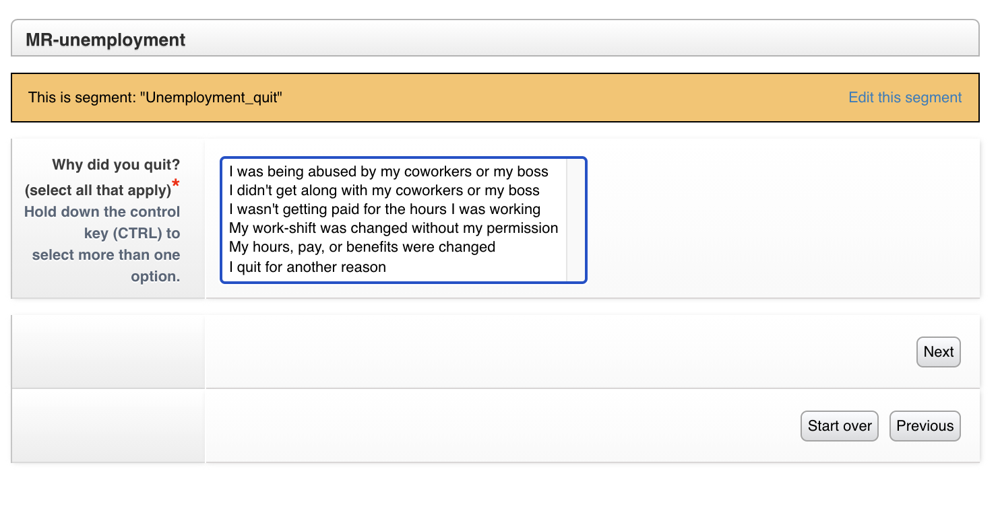

.. _otis-guided-navigation-label:
==============================
Guided Navigation Overview
==============================

Guided navigation is a system in LegalServer that allows for the creation of "expert system"-like forms. ILAO is piloting it as an alternative to webform triage rules in some cases.

Each dialogue is a process that contains segments. Each segment can be rendered as a form and exit to other segments or to other dialogues or just end.

Question 1 asks for the reason a user is unemployed

Selecting I quit takes the user to this screen:

Creating Dialogues & Segments
==============================

As a practice:

* Dialogues used as starting points in OTIS should match top level LSC problem codes.
* Dialogues used within Guided Navigation to surface sub-issues are not matched to LSC problem codes.
* Segments within Dialogues are set to 1 question or instruction (elements) per segment.
* Segments within Dialogues can have multiple elements if nothing is being displayed to the OTIS applicant.
* Applicants may be moved from one dialogue to another based on answers. For example, an applicant may enter on Bankruptcy and get moved to Foreclosure when they are seeking a bankruptcy to save their home.

Examples
-----------
ILAO may create a Guided Navigation for Divorce that is called from OTIS when a user may have a divorce issue.

The divorce dialogue may call a "has domestic violence" dialogue that sets whether there is DV in the divorce before returning to ask the user additional divorce triage questions.

The has domestic violence dialogue has 4 segments each containing 1 question. The result sets a single field "hasDV" to true.

Steps to create Dialogues & Segments
--------------------------------------
Step 1
^^^^^^^^
Create a new Dialogue within LegalServer by searching Guided Navigation within the Admin tab. New Dialogues should be created as Interactive Dialogue (plus in the top right of the list of interactive dialogues). 

Step 2
^^^^^^^^
Create new Segments within the Dialogue. Each Segment should have only one question or instruction. Each question within a segment is made by creating a custom field and custom lookup values. Custom fields and lookup values can be create from within the Segment by selecting Create Field in the top right corner of the Segment.

[image: create_field]

.. note:: Custom Fields should follow the naming convention "ilao-[issue]_short title". 

[image: field_name]

Step 3
^^^^^^^^
Choose New Custom Lookup from the types. The Custom Lookup will automatically be given the same name as the Custom Field. Assign answer options as Lookup values.

[image: lookup_values]

Step 4
^^^^^^^^
Add the Custom Field to the Segment by adding an element, select Field to capture from the dropdown, and find the field using the "ilao-[issue)_short title" provided earlier. Once the correct field is identified, give the field a Label. The label will be displayed to the applicant as the question.

To add instructions to a segment, simply Add element, select Instructions and complete the box with the text you want to display to the applicant. 

Step 5
^^^^^^^^
[add output expressions]

Step 6
^^^^^^^^
[create outcomes]
[within Dialogue or switch to another]
[rest-export]

Step 7
^^^^^^^
[Create Primary Form] - 

New Intake Form - give name like, "GN-SNAP" to easily identify the form. A description is not necessary. Create New Process Containing This Form = yes; Active = yes; Add Continue Button = yes; Process type = Intake. Under Form Elements select Block and then choose Dialog Runner and Add. Within the Dialogue Runner, choose the Dialogue created above. Scroll to the bottom and Continue.

Create a Navigation Dialogue, which will route the user to the appropriate Interactive Dialogue. 
Add the Dialogue Runner Block to the form where the user should see the Dialogues.

[further expansion here]

Step 8
^^^^^^^
[Update Process created in Step 7] - rename with the following naming convention ilao-GN-[top legal issue]_[more specific legal issue]. You may not have a more specific legal issue. Two examples of names are ilao-GN-HSG_landlord and ilao-GN-SNAP. *Process can be used with the Guided Navigation API must be set to yes.* For ease of adding the legal issue to SMS and the website, copy to Process UUID and paste it in the Process Description

Integration into Website
==========================

.. note:: This is to document how we envision this will work. It has not been built yet.

GN processes will be tagged to Legal Issues. When the Legal issue is selected in the OTIS triage, the Guided Navigation process will takeover (existing triage rules will continue to be used where Guided Navigation is empty).

When Guided navigation is used, the system will:

* create a Guided navigation session
* pull the Guided navigation form(s)
* display them to the user, collect data
* send the data back to Guided navigation
* repeat until the end of the interview is reached
* take the collected profile and determine what organization(s) match against data stored in Drupal

Relationship to Program Intake Settings & Services
===================================================

Need to tie back legal issues + segment variables

