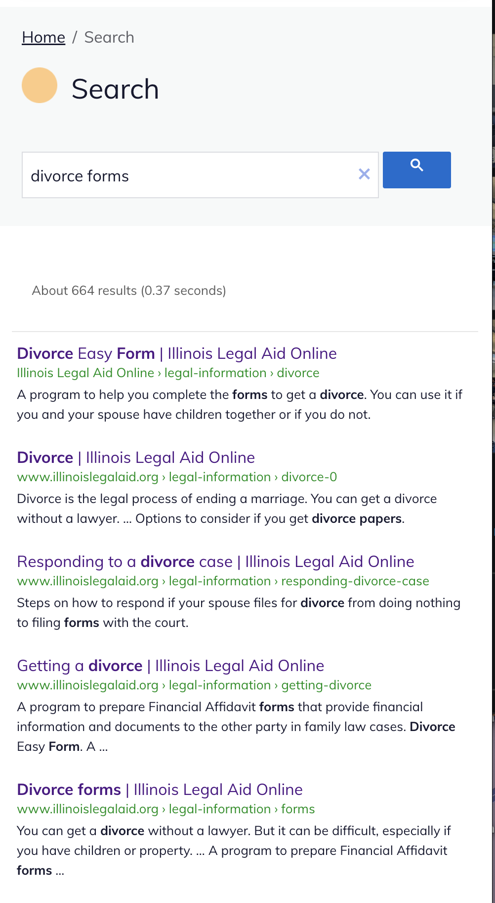

=========================
Site Search & SEO
=========================

ILAO leverages Google custom site search for our global site search. With this there are a few things to be aware of:

* The site search is based on pages we have made available to Google. If our robots.txt file blocks a specific page, Google can not include it in site search.
* Page changes will not be immediately reflected in site search. New pages need to be indexed by Google to appear and changes will not be reflected until Google updates the index. This can take a couple of weeks.
* We traded in some control, particularly over look and feel, for Google's accuracy and speed

Search collections
====================

Each language has its own custom site search index. See :ref:`custom_site_config` for configuration information.

Results
=============
Google site search works just like Google search. Google controls each result displayed.

The result usually is:

* The meta title
* Breadcrumb path
* Google snippet. This will vary depending on what Google thinks will best help the user. Sometimes this is our meta description; other times, Google uses its own snippet highlighting words that match the user's search

.. note:: We do not control what Google includes in the snippet. It is very important to include a good meta description if that is what you want Google to show.

Documentation
================

.. toctree::
   :maxdepth: 2

   google_custom_site_search_config
   gcs_autocomplete
   gcs_enhancements
   gcs_promotions

