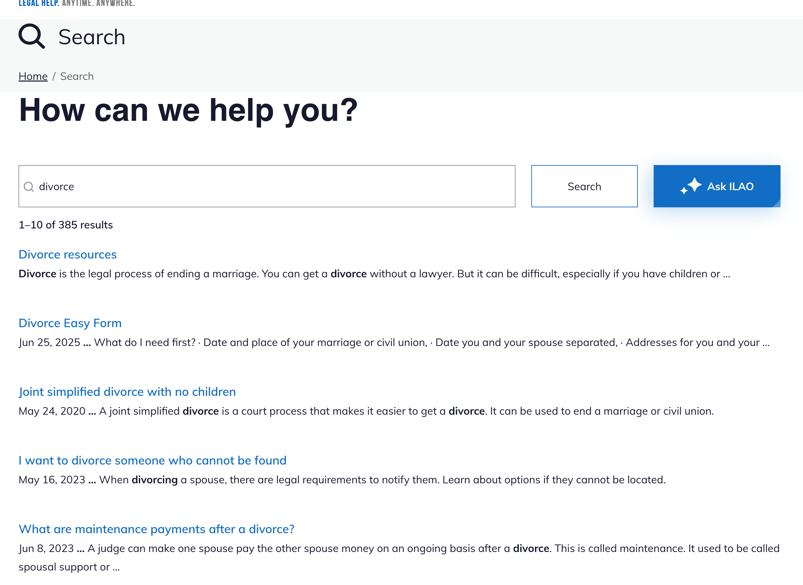
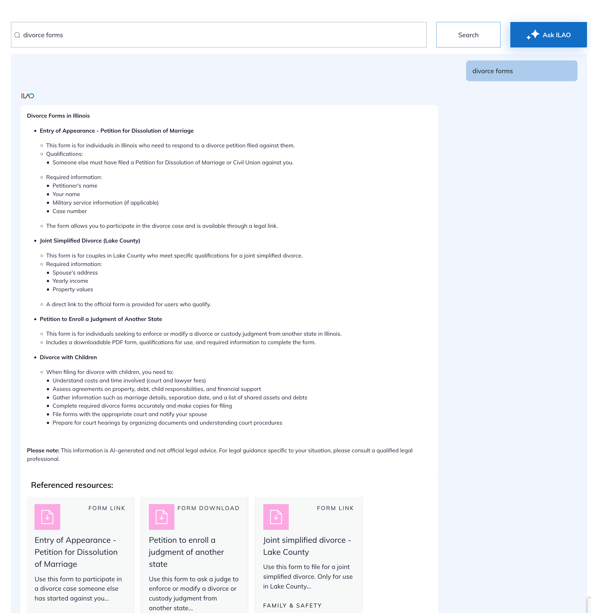

=========================
Site Search & Ask ILAO
=========================

Our search consists of two pieces:

* Ask ILAO, which is a GPT-based chatbot that provides answers to user questions based on ILAO's content
* Site search, which is based on a custom Google Vertex AI search

.. note:: Ask ILAO is only available on the English website.

Site search
==============
The site search looks very much like Google's search results. 

Google site search works just like Google search. Google controls each result displayed.

The result usually is:

* The meta title
* Breadcrumb path
* Google snippet. This will vary depending on what Google thinks will best help the user. Sometimes this is our meta description; other times, Google uses its own snippet highlighting words that match the user’s search.

Ask ILAO
=============
Ask ILAO looks more like a chatbot and provides a GPT-generated response with links to the reference resources on Illinois Legal Aid Online.

Documentation
================

.. toctree::
   :maxdepth: 2

   google_custom_site_search_config
   ask_ilao
   

