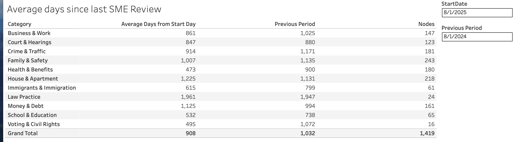

==============================
Tableau: SME Reviews
==============================

`SME reviews <https://prod-useast-b.online.tableau.com/#/site/ilaootis/views/contentMetrics/Averagedays-SMErevisions>`_ are defined as each time the Last SME review date was changed in the CMS for a piece of legal content.

The report shows the average number of days since the last SME review based on the date entered as the Start date. That can be compared to a previous date using the Previous period date field.

It shows the current number of articles in each category.

