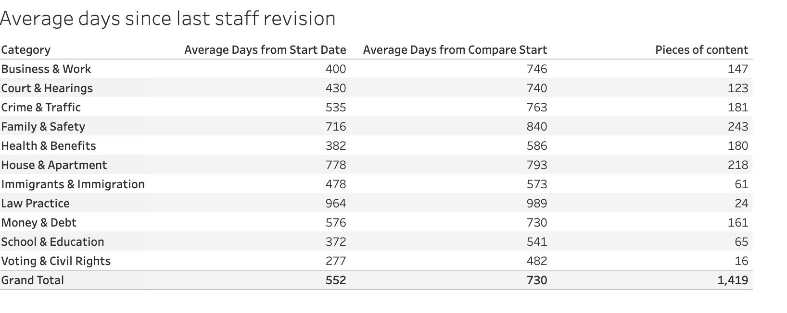

=========================
Tableau: Staff Revisions
=========================

Staff revisions are defined as unique dates where a piece of legal content has had the last reviewed by staff date changed.

The report shows the average number of days since the last time a staff member marked the content as substantively revised based on the date entered as the Start date. That can be compared to a previous date using the Previous period date field.

