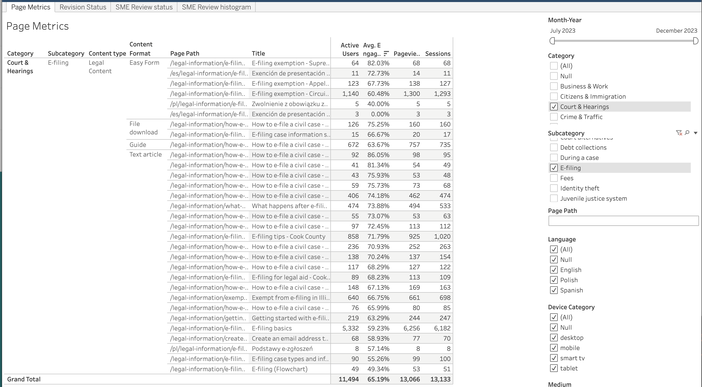
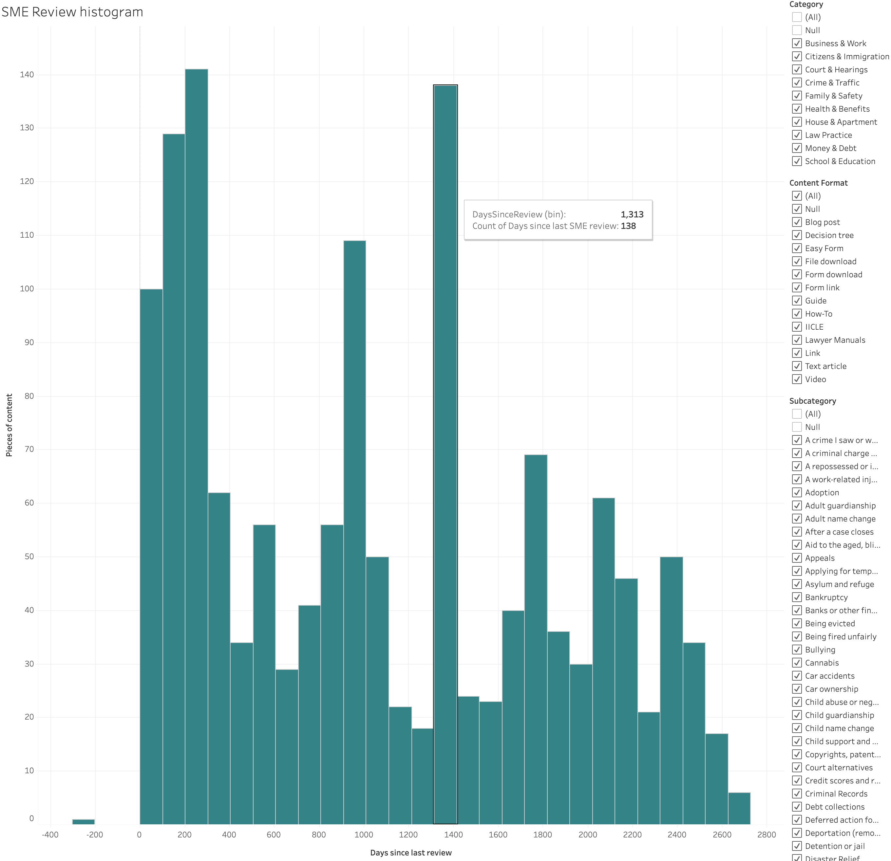

===============================
Tableau Workbook: GA Core data
===============================

The GA core data report can be accessed on our `tableau cloud <https://prod-useast-b.online.tableau.com/#/site/ilaootis/workbooks/1194017?:origin=card_share_link>`_.

This core data set can be filtered geographically only down to a region (state) level.

Page metrics
===============

Page metrics show the number of active users, average engagement rate, pageviews, and sessions for each page of the website. It can be filtered on:

* Month/Year.

.. note:: Each month's data is available with the date mm/1/yyyy.

* Category. This is pulled from the Primary legal category field in legal content. For pages on our site that are not legal content, set the category to "null"
* Subcategory. This is pulled from the Primary 2nd level taxonomy term field in legal content. This filter will automatically change to show only subcategories that are aligned with the categories in the dataset.
* Page path. Optional - this will further limit filters and is most useful outside of legal content (for example, to filter on get legal help, enter /get-legal-help).

.. note:: Because content managers assign category and subcategory terms, there is the potential that the terms may not match with our taxonomy (that is a subcategory term in the wrong primary category). Alert the content team if such issues are seen.

* Language. This is pulled from legal content; if filtering on non-legal content pages, use the page path to filter on /es/ for Spanish and /pl/ for Polish.

* Device category. This is pulled from Google analytics data
* Medium. This is how website traffic arrived at the site.
* Source. This is the more specific source for a medium. If a specific medium is selected, this list will update to only those sources that match the medium.
* Country. This is the Google-detected country. Goolg detects most countries; there are very few "not set" in the data set.
* Region. Region will update based on the country. Regions include states (US, Mexico), provinces (Canada) for example.

The report is grouped by:

* Legal category (only relevant to legal content; will be null otherwise)
* Subcategory (only relevant to legal content; will be null otherwise)
* Content format (only relevant to the Legal Content type)
* Page path
* Title
* Active users. This is the number of people who engaged with the website. This is analgous to Universal Analytics' Users.
* Average engagement rate. Measures the percentage of visitors who interacted with a piece of content, like clicking on the link, filling out a form, or spending a significant amount of time on the site.
* Pageviews. An instancer of a page being loaded or reloaded in a browser
* Sessions. From GA4: a session initiates when a user either opens your app in the foreground or views a page or screen and no session is currently active (e.g. their previous session has timed out). By default, a session ends (times out) after 30 minutes of user inactivity. There is no limit to how long a session can last.

Revision status
=================
This sheet allows one to filter and see the revision and review status of legal content. Because substantive revisions and SME reviews are only stored on the English version of content, there is no ability to filter by language.

It can be filtered on:

* Days since last staff revision.
* Days since last SME review. This may be helpful to get a list of content that has been recently reviewed or is more in need of review.
* Category. This is pulled from the Primary legal category field in legal content.
* Subcategory. This is pulled from the Primary 2nd level taxonomy term field in legal content. This filter will automatically change to show only subcategories that are aligned with the categories in the dataset.
* Content format. This may be helpful as some formats are likely to be reviewed or revised less frequently than others.

.. note:: Because content managers assign category and subcategory terms, there is the potential that the terms may not match with our taxonomy (that is a subcategory term in the wrong primary category). Alert the content team if such issues are seen.

The report is grouped by:

* Legal category
* Subcategory
* Content format (only relevant to the Legal Content type)
* Title
* Node ID
* Last revised by staff date
* Days since last staff revision
* Last SME review date
* Days since last SME review

SME review status
====================
This is a simple widget that shows average last SME review and pieces of content by legal category and is filterable by content format.

SME Review histogram
======================

This shows a distribution of days since last SME review across legal content. For example, in the image below, 100 pieces of content have been reveiewed within the last 100 days. The image can be filtered by category, format, and subcategory.

Legal Content Volunteer Impact
==================================

This shows the name of each Legal Content Volunteer pulled from Salesforce, their organization (from Salesforce), the number of articles they reviewed in the event date period and the number of visitors who viewed the article and the number of views in the date range (from Google Analytics).

* Date - this is the Google Analytics date range. All views for a particular month are set to the 1st of the month.
* Event date - this is the LCV engagement date from Salesforce
* Category - primary legal content category for the content reviewed
* Subcategory - secondary legal conten category for the content reviewed

Hot Topics
=============

This shows the most populater level 2 categories for a particular time frame. This can be filtered by Language and Primary legal category.

