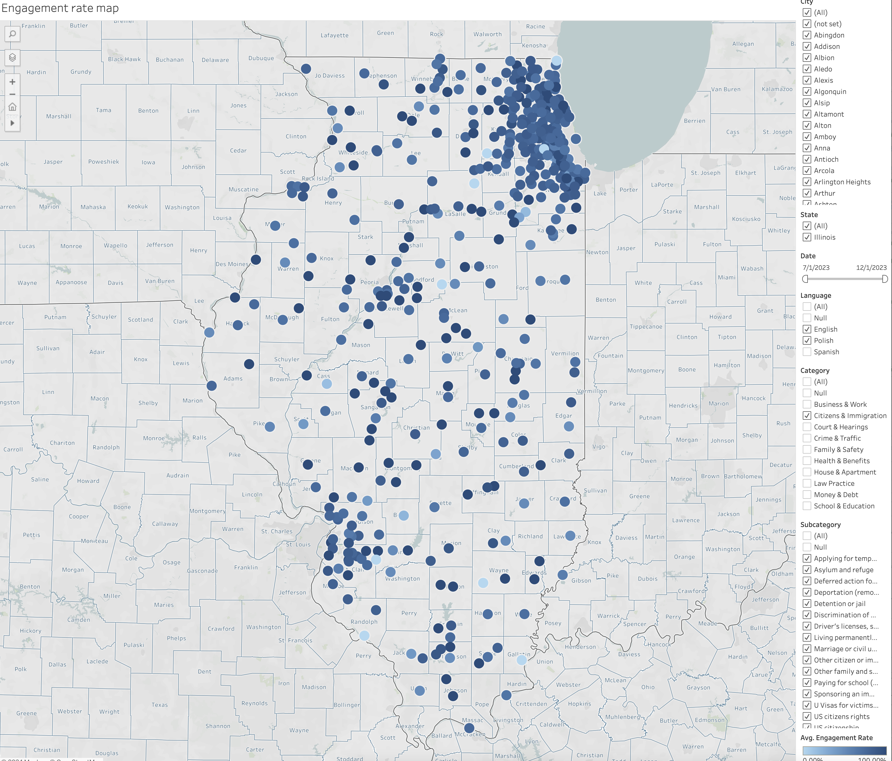

==========================================
Tableau Workbook: GA Core data (Illinois)
==========================================

.. note: The key difference between this data set and the full core data set is that it is limited to Illinois and includes city as a filter.

The Illinois workbook can be found on  `ILAO's Tableau cloud <https://prod-useast-b.online.tableau.com/#/site/ilaootis/workbooks/1197219?:origin=card_share_link>`_.

Page metrics
==============

The page metrics report mirrors that of the core data except for geographic filters.

Page metrics show the number of active users, average engagement rate, pageviews, and sessions for each page of the website. It can be filtered on:

* Month/Year.
* Category. This is pulled from the Primary legal category field in legal content. For pages on our site that are not legal content, set the category to "null"
* Subcategory. This is pulled from the Primary 2nd level taxonomy term field in legal content. This filter will automatically change to show only subcategories that are aligned with the categories in the dataset.
* Page path. Optional - this will further limit filters and is most useful outside of legal content (for example, to filter on get legal help, enter /get-legal-help).

.. note:: Because content managers assign category and subcategory terms, there is the potential that the terms may not match with our taxonomy (that is a subcategory term in the wrong primary category). Alert the content team if such issues are seen.

* Language. This is pulled from legal content; if filtering on non-legal content pages, use the page path to filter on /es/ for Spanish and /pl/ for Polish.

* Device category. This is pulled from Google analytics data
* Medium. This is how website traffic arrived at the site.
* Source. This is the more specific source for a medium. If a specific medium is selected, this list will update to only those sources that match the medium.
* City.

.. note:: Google Analytics data is somewhat unreliable at the city level. There tends to be more "not set" values at this level, compared to country or region.

The report is grouped by:

* Legal category (only relevant to legal content; will be null otherwise)
* Subcategory (only relevant to legal content; will be null otherwise)
* Content type
* Content format (only relevant to the Legal Content type)
* Page path
* Title
* Active users. This is the number of people who engaged with the website. This is analgous to Universal Analytics' Users.
* Average engagement rate. Measures the percentage of visitors who interacted with a piece of content, like clicking on the link, filling out a form, or spending a significant amount of time on the site.
* Pageviews. An instancer of a page being loaded or reloaded in a browser
* Sessions. From GA4: a session initiates when a user either opens your app in the foreground or views a page or screen and no session is currently active (e.g. their previous session has timed out). By default, a session ends (times out) after 30 minutes of user inactivity. There is no limit to how long a session can last.

Maps
============

We've prototyped 2 maps to show page views and average engagement rate. These are filterable by:

* Category
* Subcategory
* Date range
* Language
* City

