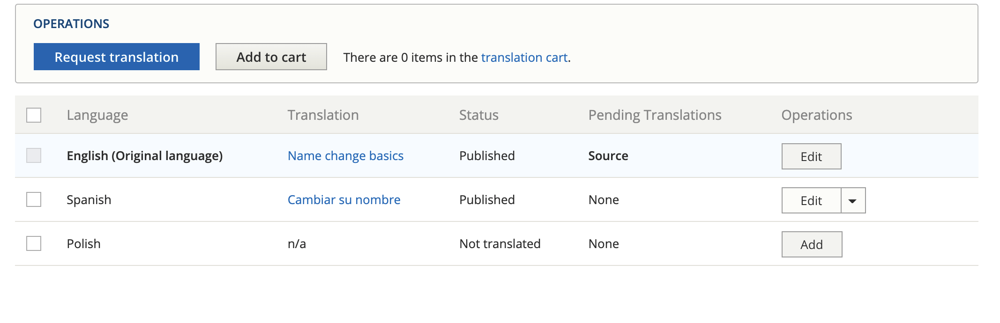
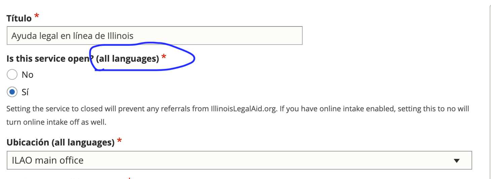

=============================
Translation Management
=============================

There are multiple places where translations can be managed, depending on the use case:

.. toctree::
   :maxdepth: 2
   :caption: Contents:

   translation_motionpoint
   translation_mgmt_lc
   translation_content
   translation_ui
   translation_config
   cms_webforms_translation
   otis_sms_translations

Content translation includes:

* Content types, like legal content, basic pages, organizations, locations, and services.
* Blocks, like the banner on the top of pages

Node translation
=========================

Content can be translated by clicking the "Translate" link on the edit page or when viewing the content and clicking Add to create a new translation or Edit to edit an existing translation under Operations

In the image above, there is a Spanish translation that can be edited. A Polish translation would need to be added.

Shared fields
------------------

Shared fields are those that are shared across languages. For example, the legal issues taxonomy on legal content are the same regardless of language so the field to tag content to legal issue is shared across all languages - a change in one language affects all languages.

For some content types, like legal content, fields that are shared are only visible on English content.

For other types of content, where conditional fields or paragraphs cause issues with hiding shared fields, the fields are visible but have an (all languages) label.

