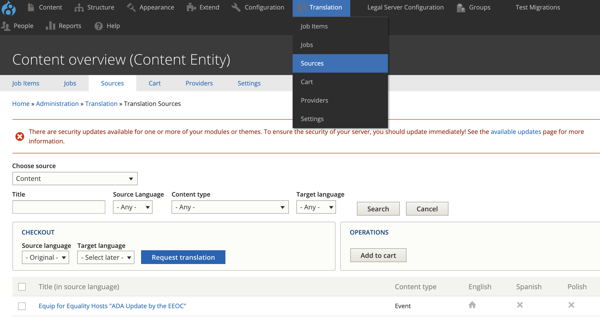
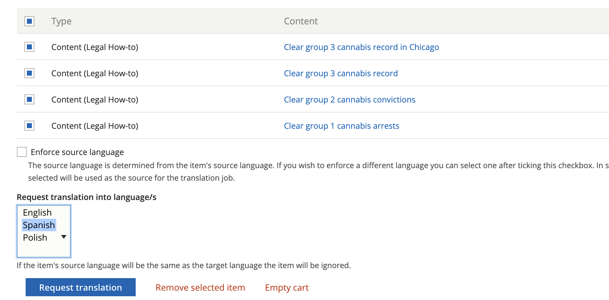
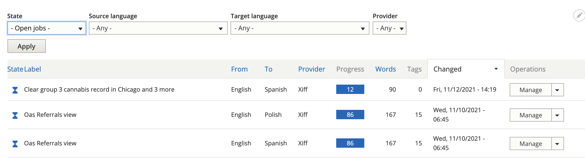
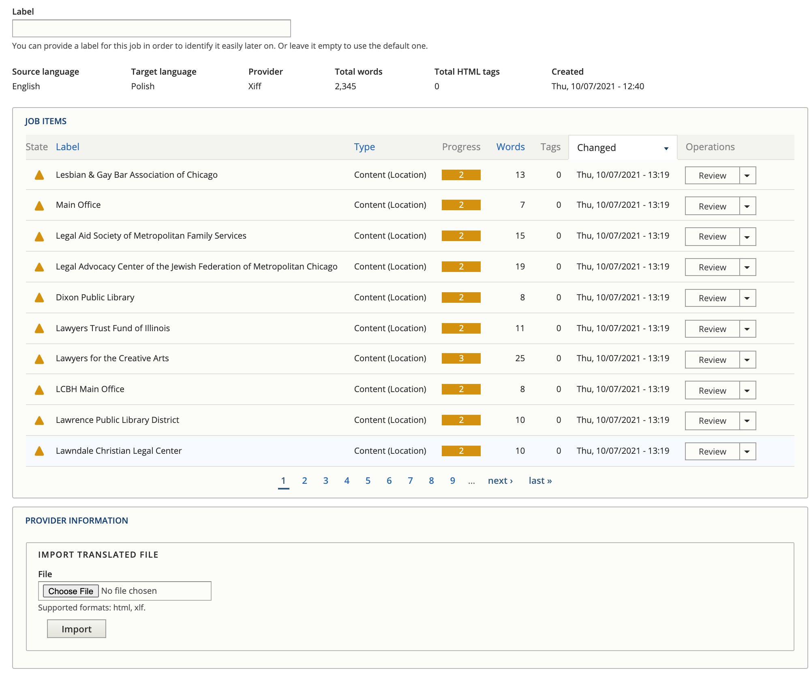
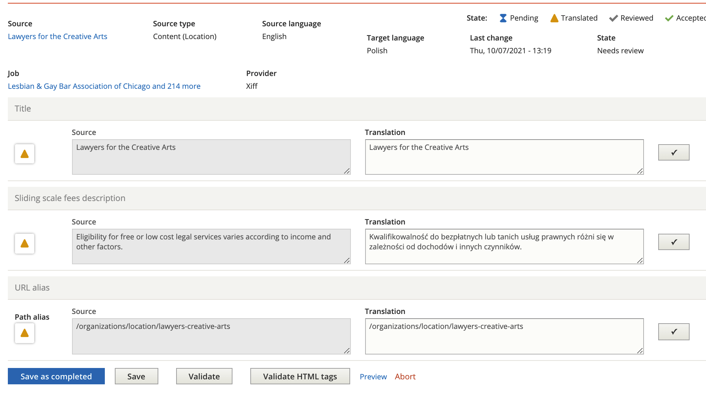

===========================================
Using the Translation Management System
===========================================

The translation management system can be used to import and export content for translation. This can be done:

* Directly in content, by clicking translate and add to cart or request translation
* Using `sources <https://www.illinoislegalaid.org/admin/tmgmt/sources>`_ under the Translation menu.

Using source, you can:

* Filter on a source type. The source type for content items is content. Blocks can also be accessed here.
* Filter by Content type
* Check the nodes you want to add to cart (you do have to page through all pages)

Checking out a cart
---------------------
To check out a cart, select the language(s) to translate to and press Request translation.

Check out a job
-------------------

You can check out a job in Xliff or HTML format. Xliff is usable with POeditor and many translation systems. Check the job out by pressing "Submit to provider" This will then show a file can be downloaded here message.

Importing a file
-------------------

Translations are in jobs that can then be imported back in by selecting Manage next to the job on the `Jobs <https://www.illinoislegalaid.org/admin/tmgmt/jobs>`_ tab.

This will show a list of content in the job and a space to import a translated file. Once a file is imported, each content needs to be reviewed.

Reviewing content
-------------------

Pressing review next to an item will show a page with all of the translatable fields.

* Press the check next to a translation to approve it
* You can change the text if it is incorrect
* You can save and return
* You can save as completed. This is true even if yu do not approve all translations.

