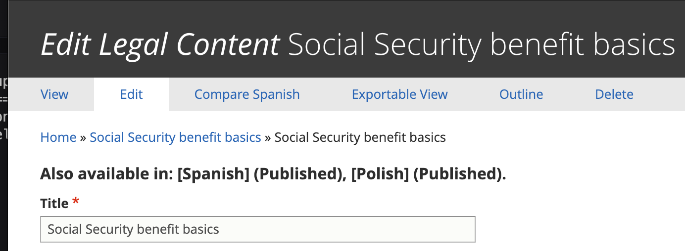
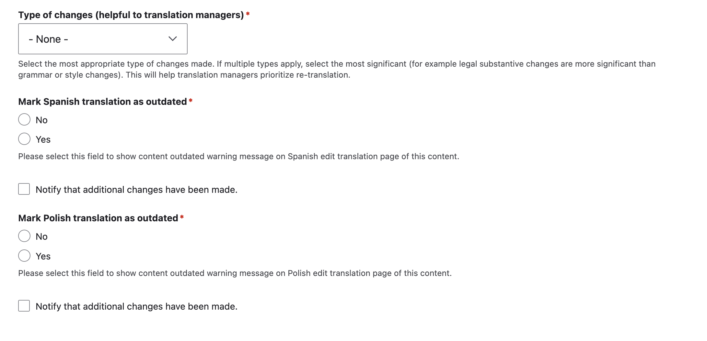
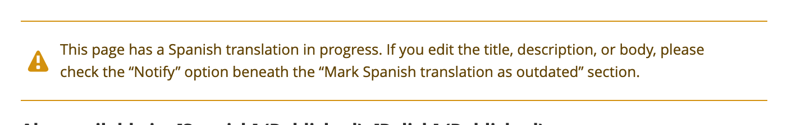

==========================================
Translation management in legal content
==========================================

.. note:: These are reflective of changes being made in winter 2023/2024.

Language Availability
=======================

On the edit form, the languages that a particular piece of legal content is available in appears at the top, along with the current published/unpublished status.

When an English translation is updated
========================================
When a piece of English legal content is updated, if the changes impact the title, description, or the content itself, the translation(s) should be marked as outdated.

Indicate the type of change made. If multiple changes were made, indicate the most significant change made. This helps the content manager prioritize translation updates. If only metadata was changed, indicate that and then set the translation outdated to No if no other changes were made.

If the English changes have now made another translation outdated, check "Yes" for that language. If not, select "No"

.. note:: Spanish and Polish outdated status are separated to allow us to manage the workflow for each language as the translation for one may occur before the other or be handled differently.

When a translation is marked outdated in English
---------------------------------------------------

When a translation is marked outdated, when viewing the outdated language:

* The translation status will be updated to "Outdated" automatically
* A warning will appear at the top of the Spanish/Polish edit form warning that the English version has been updated and this version is now out of date.

When a Spanish or Polish translation is being worked on
==========================================================

When a Spanish or Polish translation is outdated andis being worked on (either internally or by sending it out to a vendor), the Translation status should be set to "In Progress"

Once the translation is In Progress:

* A warning will appear on the English edit form. If further edits are made in English, the English editor should check the notify checkbox so that the content manager working on the translation will be aware of additional changes.

* If additional changes are made and notification sent, the "Uncheck to indicate that changes have been reviewed" checkbox will be checked on the Spanish/Polish translation. Uncheck this will reset the Notify on the English side so that notifications stop unless the English content manager re-checks the notification checkbox.

When a Spanish or Polish translation is complete
==================================================

When a Spanish or Polish translation is completed, the content manager should set the translation status to "Completed" and save.

When the translation status is set to Completed:

* The Mark [language] translation as outdated is emptied. Any future English edits will require reselecting Yes or No.
* The translation status for [language] is set to "None (Up-to-date)" automatically
* Warnings for that [language] will disappear

When the translation status is set to Completed and there are no other outdated translations:

* the Type of Changes on the English will reset to "None"

Notifications
=================

On the English language edit form, there is a "Notify that additional changes have been made" checkbox for each language (Spanish and Polish).

This checkbox will send an email notification to the content manager responsible for the corresponding language.

This checkbox:

* Can be used on the initial marking of a translation as outdated
* Should always be used when there is an in-progress translation and additional edits to the content (title, description, or body) are made
* Should not be used when only shared fields are changed (taxonomy terms, annual updates, audience, etc).

This checkbox, once checked:

* Will remain checked until the [language] content manager clears it after reviewing changes
* Will not send additional emails unless the checkbox has been cleared, saved, and then re-checked.

.. note:: We are also working on integrating some of these workflow improvements into the XLIFF editing process.

