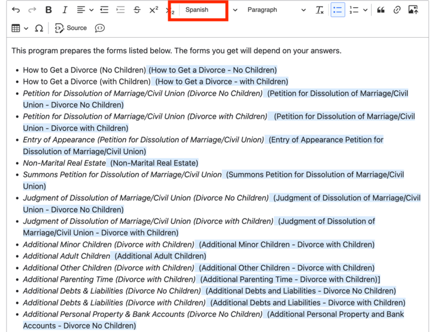

===============================
Tagging for Motionpoint
===============================

In content
================

In content, we sometimes have strings that we do not want to have Motionpoint change. The most common use case is in Easy Forms where we want the English title to appear next to the translated Spanish title.

To tag content
=================
To tell Motionpoint to ignore text and render as is:

* Highlight the text you want Motionpoint to ignore
* In the styles dropdown, select Spanish

  * The text will display in the WYSIWYG with a light blue background
  * The text will not display on the front-end of the English site
  * The text will appear **as is** on the Spanish site.
  * Will be replaced with the appropriate Motionpoint Directive Tags (DT). See below for the resulting HTML that will be shown in the "View source" in the browser on the front-end.

When rendered on the front end, the  tags will be replaced with the correct Motionpoint DT tags.

.. code:: html

   <!-- mp_trans_disable_start -->
   <!-- mp_trans_add
     The text you want ignored -->
    <!-- mp_trans_disable_end --> “

In blocks, views and other components
========================================

There are a few instances where we do not want something to appear on the Spanish site or want something that isn't content to appear on the Spanish site.

Examples:

* Removing the Ask ILAO search from Spanish
* Displaying the Spanish Vertex search on Spanish

For these cases, please see Gwen or Mike; the developers will need to implement the blocks to accommodate.
