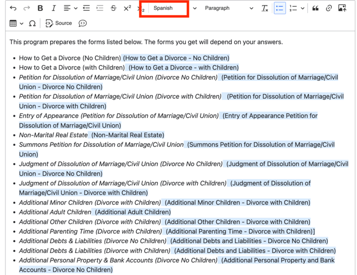

===============================
Tagging for Motionpoint
===============================

In content
================

In content, we sometimes have strings that we do not want to have Motionpoint change. The most common use case is in Easy Forms where we want the English title to appear next to the translated Spanish title.

To tag content
=================
To tell Motionpoint to ignore text and render as is:

* Highlight the text you want Motionpoint to ignore
* In the styles dropdown, select Spanish

  * The text will display in the WYSIWYG with a light blue background
  * The text will not display on the front-end of the English site
  * The text will appear **as is** on the Spanish site.
  * Will be replaced with the appropriate Motionpoint Directive Tags (DT). See below for the resulting HTML that will be shown in the "View source" in the browser on the front-end.

When rendered on the front end, the  tags will be replaced with the correct Motionpoint DT tags.

.. code:: html

   <!-- mp_trans_disable_start -->
   <!-- mp_trans_add
     The text you want ignored -->
    <!-- mp_trans_disable_end --> “

Controlling Block Visibility by Language (Motionpoint)
========================================================

Some blocks should only appear on the English site, and others only on the Spanish site. You can now control this directly in the block layout UI — no developer needed.

How it works
--------------

When a visitor lands on the Spanish site, their traffic is routed through Motionpoint's servers. The new Motionpoint visibility condition detects this and shows or hides a block accordingly.

Setting visibility on a block
-------------------------------

1. Go to **Structure > Block layout** and find the block you want to configure, or place a new block.
2. Click **Configure** on the block.
3. Scroll down to the **Visibility** section and expand it.
4. Click **Motionpoint** to expand the condition.
5. Choose your setting:
   - **Show on Spanish site only** — the block will only appear when traffic comes through Motionpoint (i.e., the Spanish site).
   - **Show on English site only** — the block will be hidden when traffic comes through Motionpoint.
   - **Show on all pages** (default) — no Motionpoint filtering; the block appears everywhere.
6. Save the block configuration.

Common use cases
------------------

**Showing a Spanish-only block** (e.g., a Spanish-language search widget or banner): place the block and set visibility to "Show on Spanish site only."

**Hiding an English-only block from Spanish** (e.g., Ask ILAO search, which has a separate Spanish equivalent): find the block and set visibility to "Show on English site only."

.. note::
    - This condition works alongside other visibility conditions (e.g., pages, roles). All conditions must be met for the block to display.
    - For more complex cases — such as views or components that need language-specific behavior — contact Gwen or Mike, as those require developer implementation.
    - Do not use native Drupal language conditions for Motionpoint-related visibility; use this condition instead.
    

