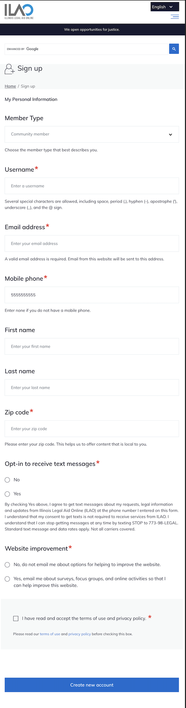
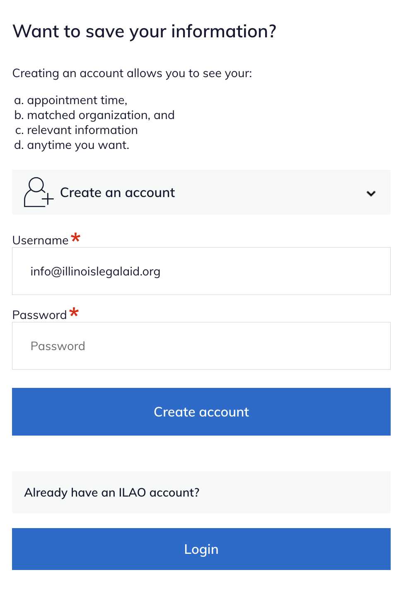
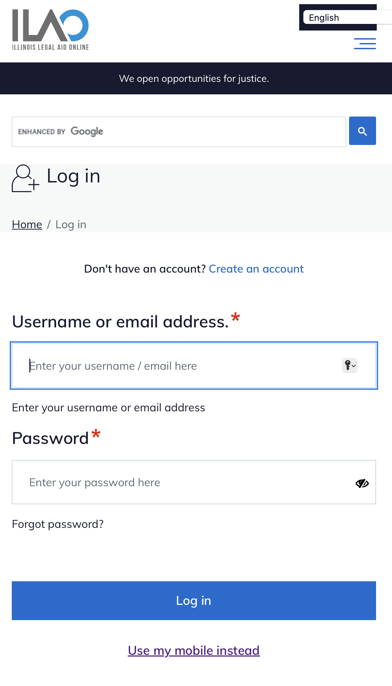
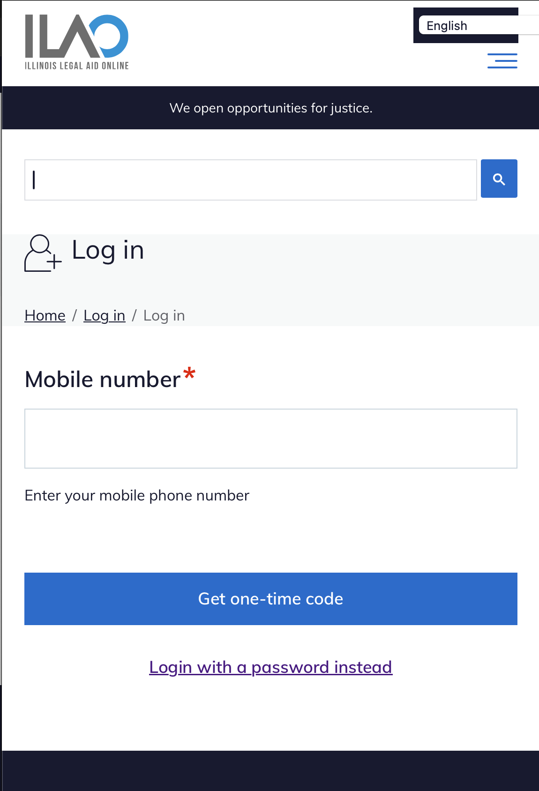
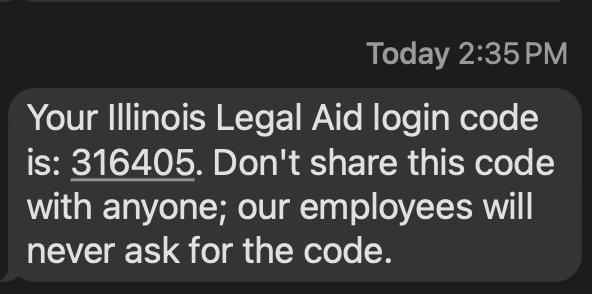
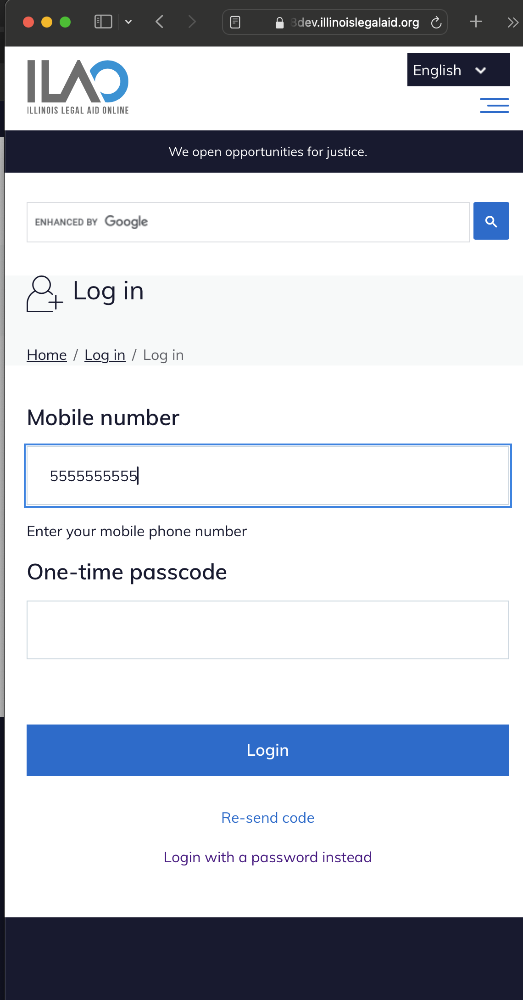

=========================================
Account creation & login process
=========================================

Users can create an account:

* on the website using a username and password
* over SMS using a mobile phone number and one-time passcode (community members only)

Users can log into an account using either a username/passcode or using a one-time passcode sent to their mobile device so long as they:

* have provided a mobile number
* have opted-in to receive text messages

Creating an account on the website
====================================

Default registration
-----------------------

Anyone can create an account on IllinoisLegalAid.org. The default form (below) is for community members. Additional forms, with slightly different fields, exist for legal aid members and legal professionals.

Create account in Get Legal Help
----------------------------------

Individuals who complete an online intake in Get Legal Help are offered the opportunity to create an account at the end of that process. Because the online application collects all of the required information, the process is streamlined and only the email and password are required on the account creation form.

Creating an account in ILAOHelps! text messaging service
==========================================================

.. note:: Coming soon

Logging in
============

Username and password
-----------------------

One-time passcode
---------------------

When the user requests the one-time code, a text message is sent with a 6 digit code.

The user then has 10 minutes to enter the code into the website.

Returning users
=================

The website will set a cookie to remember the user's login preference and default to that login form in later visits.
