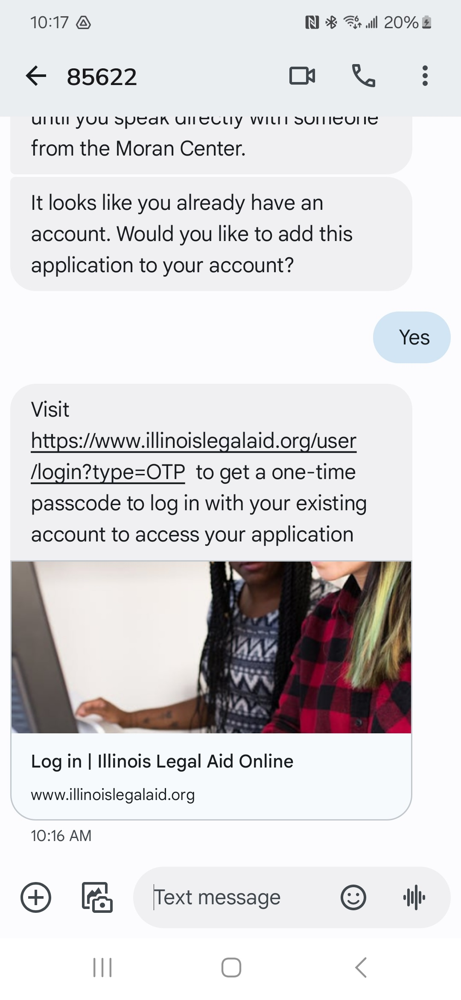
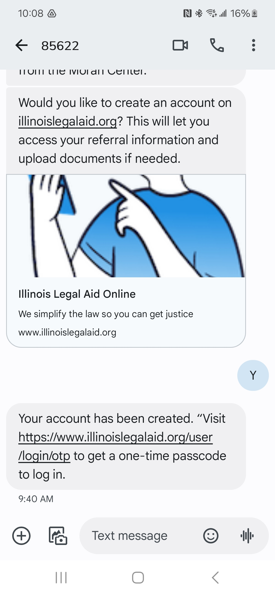

=========================================
Account creation & login process
=========================================

Users can create an account:

* on the website using a username and password
* over SMS using a mobile phone number and one-time passcode (community members only)

Users can log into an account using either a username/passcode or using a one-time passcode sent to their mobile device so long as they:

* have provided a mobile number
* have opted-in to receive text messages

Creating an account on the website
====================================

Default registration
-----------------------

Anyone can create an account on IllinoisLegalAid.org. The default form (below) is for community members. Additional forms, with slightly different fields, exist for legal aid members and legal professionals.

.. image:: ../assets/cm_signup_form.png

Create account in Get Legal Help
----------------------------------

Individuals who complete an online intake in Get Legal Help are offered the opportunity to create an account at the end of that process. Because the online application collects all of the required information, the process is streamlined and only the email and password are required on the account creation form.

.. image:: ../assets/create_account_otis.png

Creating an account in ILAOHelps! text messaging service
==========================================================

Individuals who complete an application using the ILAOHelps! text messaging service are offered the opportunity to either create an account at the end of the application process or associate their application with their existing account.

Similar to online applications, ILAOHelps! text messaging service completes an entire intake for the individual, gathering important contact information, including mobile number and email address. When the intake portion of the application is complete, the system quickly performs a querie on the site to see if there are any accounts on IllinoisLegalAid.org that are using either the individual's email address or mobile number.  

The individual has an account
-------------------------------

If an account on IllinoisLegalAid.org exists using either the applicant's email address or mobile number, they are asked if they would like to add the current application to their account.

The individual does not have an account
---------------------------------------

If an account on IllinoisLegalAid.org does not exist with the applicant's email address or mobile number, they are asked if they would like to create one. The individual is informed that creating an account will help them later access their referral information or upload documents if needed. To create an account, the applicant only needs to answer yes to the question, and the account is created for them.

Once an account is created, the applicant receives a confirmation message with a link to log into IllinoisLegalAid.org using a One-time passcode.

The new account is automatically validated as a community member.

Logging in
============

Username and password
-----------------------

.. image:: ../assets/login_form_email.png

One-time passcode
---------------------

.. image:: ../assets/login_otp_init.png

When the user requests the one-time code, a text message is sent with a 6 digit code.

.. image:: ../assets/otp_text.png

The user then has 10 minutes to enter the code into the website.

.. image:: ../assets/login_otp_data_entry.png

Returning users
=================

The website will set a cookie to remember the user's login preference and default to that login form in later visits.
