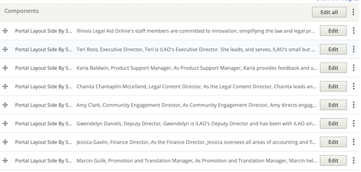
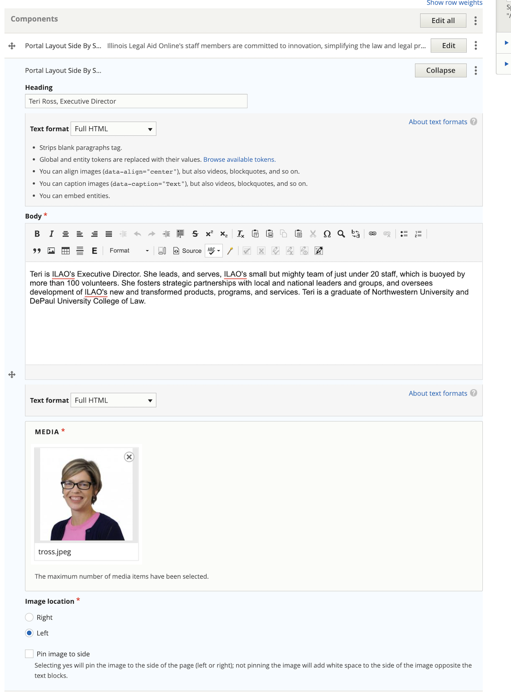

=========================
Staff, Board & YPB pages
=========================

Staff
========
The Staff page lists each staff member. Each staff member is added using a separate portal layout side-by-side component.

Staff are ordered with the Executive Director listed first, then alphabetical. In the summer, a media + text block is added to list all of our interns and fellows at the bottom.

Each portal layout side-by-sider and should adhere to this style:

* Image; if no image has been provided, use the people placeholder image. If an image is provided and is large, it should be resized to 300 pixels wide.
* Name in the heading field
* Next line is their job title, italicized
* Biography in the body field

If one needs to insert a new board member, they may need to edit the portal layout side-by-side under the new board member to change the image location to preserve the alternating left/right layout.

Board
========
The Board of Directors page lists each board member. Each board member is added using a separate portal layout side-by-side component.

Board members are ordered first by office, then alphabetical. Officers are listed in the order of chair, vice-chair, treasurer, secretary.

Each portal layout side-by-sider and should adhere to this style:

* Image; if no image has been provided, use the people placeholder image. If an image is provided and is large, it should be resized to 300 pixels wide.
* Name, bolded (or put in heading field)
* If the board member is an officer, their officer position is listed after their name
* Next line is their job title and affiliation, italicized
* Biography in the body field

If one needs to insert a new board member, they may need to edit the portal layout side-by-side under the new board member to change the image location to preserve the alternating left/right layout.

YPB
========

The Young Professionals Board page lists the name and role of each member in a single text block. This can be edited by anyone on the staff.
