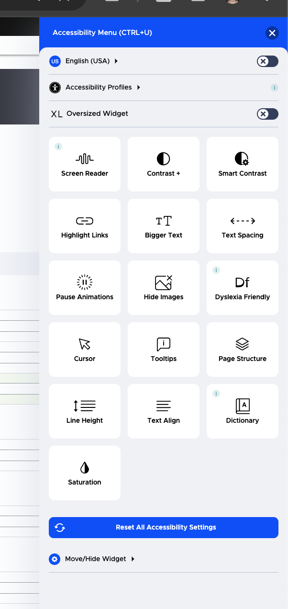

==============================
UserWay Accessibility Widget
==============================

On all of the website pages (front and back end), we have the UserWay accessibility widget installed.

With this widget, anyone can:

* Change language to see the widget interface in most languages
* Select an accessibility profile to use by default when accessing our website. Supported profiles include:

  * Motor-impaired
  * Color blind
  * Blind
  * Dyslexia
  * Visually-impaired
  * Cognitive and Learning
  * Seizure and epileptic
  * ADHD

* Set custom controls. Instead of using a pre-defined profile, anyone can set their own settings. Settings include:

  * Screen reader
  * Contrast (invert colors, dark, or light contrast)
  * Smart contrast (good for outdoor/bright/low light situations)
  * Highlighting of links
  * Increase or decrease spacing between text
  * Adjust line height
  * Play or pause animations
  * Show or hide images
  * Use a dyslexia friendly font
  * Increase the size of the cursor, use a reading guide or mask
  * Show tooltips
  * Show page structure
  * Change text alignment
  * Use a dictionary
  * Change the color saturation

